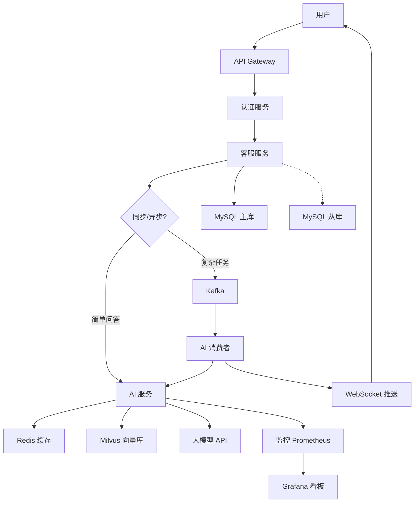

# AI 后端架构设计实战：微服务集成、事件驱动与高可用方案

> **写在前面：** 将 AI 能力集成到现有后端架构中，不是简单的 API 调用，而是需要系统性的架构设计。如何在微服务架构中优雅地集成大模型？如何设计异步事件驱动的 AI 处理流程？如何保证 AI 服务的高可用和可扩展性？本文详细讲解 AI 后端的架构设计原则、模式选择和实战方案！

---

## 📋 目录

- [一、AI 架构设计的核心挑战](#一ai-架构设计的核心挑战)
- [二、单体架构 vs 微服务架构](#二单体架构-vs-微服务架构)
- [三、微服务中的 AI 集成模式](#三微服务中的-ai-集成模式)
- [四、事件驱动的 AI 处理](#四事件驱动的-ai-处理)
- [五、CQRS 模式应用](#五cqrs-模式应用)
- [六、高可用架构设计](#六高可用架构设计)
- [七、可扩展性设计](#七可扩展性设计)
- [八、完整架构案例](#八完整架构案例)
- [九、技术选型建议](#九技术选型建议)
- [十、最佳实践总结](#十最佳实践总结)

---

## 一、AI 架构设计的核心挑战

### 1.1 四大核心挑战

#### 挑战 1：响应延迟

**问题：**
```
大模型 API 调用：500ms - 5s
传统接口响应：< 100ms

差距：5-50 倍
```

**影响：**
- 用户体验差
- 同步阻塞资源
- 吞吐量受限

---

#### 挑战 2：状态管理

**问题：**
```
多轮对话需要维护会话状态
分布式环境下状态共享困难
```

**场景：**
```
用户 A → 网关 → 服务实例 1（保存会话）
用户 A → 网关 → 服务实例 2（找不到会话）❌
```

---

#### 挑战 3：成本控制

**问题：**
```
大模型 API 按 Token 计费
无限制的调用 = 成本爆炸
```

**案例：**
```
某电商智能客服：
- 日活用户：10 万
- 平均每用户 10 轮对话
- 每轮对话 500 tokens
- 每日 Token 消耗：10万 × 10 × 500 = 5 亿 tokens
- 月度费用：5亿 × 30 × 0.004元/千tokens = 60,000 元
```

---

#### 挑战 4：数据隐私

**问题：**
```
云端 API：数据传出企业边界
敏感数据：订单、用户信息、商业机密
合规要求：GDPR、数据安全法
```

---

## 二、单体架构 vs 微服务架构

### 2.1 单体架构集成 AI

**架构示意：**

```
┌─────────────────────────┐
│   SpringBoot 单体应用    │
│                         │
│  ┌───────────────────┐  │
│  │  Controller 层     │  │
│  └────────┬──────────┘  │
│           │              │
│  ┌────────▼──────────┐  │
│  │  Service 层        │  │
│  │  + LLMService     │  │
│  └────────┬──────────┘  │
│           │              │
│  ┌────────▼──────────┐  │
│  │  Mapper 层         │  │
│  └───────────────────┘  │
└─────────────────────────┘
```

**优点：**
- ✅ 简单直接，易于开发
- ✅ 无需服务间通信
- ✅ 事务管理简单

**缺点：**
- ❌ AI 模块耦合度高
- ❌ 无法独立扩展
- ❌ 单点故障风险

**适用场景：**
- 小规模项目（日活 < 1 万）
- 快速原型验证
- 初创团队

---

### 2.2 微服务架构集成 AI

**架构示意：**

```
                    ┌─────────────┐
                    │ API Gateway │
                    └──────┬──────┘
                           │
          ┌────────────────┼────────────────┐
          │                │                │
   ┌──────▼──────┐  ┌─────▼──────┐  ┌─────▼──────┐
   │ 用户服务     │  │ 订单服务    │  │ AI 服务     │
   │ UserSvc     │  │ OrderSvc   │  │ AIService  │
   └─────────────┘  └────────────┘  └─────┬──────┘
                                          │
                                   ┌──────▼──────┐
                                   │ 向量数据库   │
                                   │ Milvus      │
                                   └─────────────┘
```

**优点：**
- ✅ AI 模块独立部署和扩展
- ✅ 技术栈灵活（可用 Python）
- ✅ 故障隔离

**缺点：**
- ❌ 架构复杂度高
- ❌ 服务间通信开销
- ❌ 分布式事务问题

**适用场景：**
- 中大规模项目（日活 > 10 万）
- 多团队协作
- 需要独立扩展 AI 能力

---

## 三、微服务中的 AI 集成模式

### 3.1 模式 1：独立 AI 服务（推荐）

**架构：**

```
业务服务 ──RPC/HTTP──> AI 服务 ──API──> 大模型
```

**实现示例：**

**AI 服务接口定义：**

```java
// ai-service-api module
public interface AIService {
    
    /**
     * 智能问答
     */
    ChatResponse chat(ChatRequest request);
    
    /**
     * 流式问答
     */
    Flux<String> streamChat(ChatRequest request);
    
    /**
     * RAG 检索增强问答
     */
    RagResponse ragChat(RagRequest request);
    
    /**
     * Function Call
     */
    FunctionCallResponse functionCall(FunctionCallRequest request);
}
```

**AI 服务实现：**

```java
@Service
public class AIServiceImpl implements AIService {
    
    @Autowired
    private LLMClient llmClient;
    
    @Autowired
    private VectorDBClient vectorDB;
    
    @Override
    public ChatResponse chat(ChatRequest request) {
        // 1. 参数校验
        validateRequest(request);
        
        // 2. 调用大模型
        String response = llmClient.chat(request.getPrompt());
        
        // 3. 结果处理
        return ChatResponse.builder()
            .content(response)
            .tokens(llmClient.getLastTokenUsage())
            .build();
    }
    
    @Override
    public RagResponse ragChat(RagRequest request) {
        // 1. 向量检索
        List<Document> docs = vectorDB.search(
            request.getQuery(), 
            request.getTopK()
        );
        
        // 2. 构建 Prompt
        String prompt = buildRagPrompt(request.getQuery(), docs);
        
        // 3. 调用大模型
        String answer = llmClient.chat(prompt);
        
        return RagResponse.builder()
            .answer(answer)
            .sources(docs)
            .build();
    }
}
```

**业务服务调用：**

```java
@Service
public class CustomerServiceServiceImpl {
    
    @Autowired
    private AIServiceClient aiServiceClient;  // Feign Client
    
    public String answerCustomerQuestion(String question) {
        ChatRequest request = ChatRequest.builder()
            .prompt(question)
            .temperature(0.7)
            .build();
        
        ChatResponse response = aiServiceClient.chat(request);
        
        return response.getContent();
    }
}
```

**Feign Client 配置：**

```java
@FeignClient(name = "ai-service", url = "${ai.service.url}")
public interface AIServiceClient {
    
    @PostMapping("/api/chat")
    ChatResponse chat(@RequestBody ChatRequest request);
    
    @PostMapping("/api/rag/chat")
    RagResponse ragChat(@RequestBody RagRequest request);
}
```

---

### 3.2 模式 2：Sidecar 模式

**架构：**

```
┌──────────────────────┐
│  业务容器             │
│  (Java/SpringBoot)   │
│                      │
│  ┌────────────────┐  │
│  │ AI Sidecar     │  │
│  │ (Python/FastAPI)│  │
│  └────────────────┘  │
└──────────────────────┘
```

**优势：**
- ✅ 业务代码和 AI 代码解耦
- ✅ 可使用最适合的语言（Python for AI）
- ✅ 独立升级

**实现：**

**Sidecar 服务（Python）：**

```python
# ai_sidecar.py
from fastapi import FastAPI
from langchain.chains import ConversationalRetrievalChain

app = FastAPI()

@app.post("/chat")
async def chat(request: ChatRequest):
    # 调用大模型
    response = llm.chat(request.prompt)
    return {"content": response}

@app.post("/rag")
async def rag(request: RagRequest):
    # RAG 检索
    docs = vector_db.similarity_search(request.query)
    answer = llm.generate_with_context(request.query, docs)
    return {"answer": answer, "sources": docs}
```

**业务服务调用（本地 HTTP）：**

```java
@Service
public class LocalAIService {
    
    private static final String SIDECAR_URL = "http://localhost:8000";
    
    public String chat(String prompt) {
        RestTemplate restTemplate = new RestTemplate();
        
        ChatRequest request = new ChatRequest(prompt);
        ChatResponse response = restTemplate.postForObject(
            SIDECAR_URL + "/chat",
            request,
            ChatResponse.class
        );
        
        return response.getContent();
    }
}
```

---

### 3.3 模式 3：SDK 嵌入模式

**架构：**

```
业务服务内部直接集成 LangChain4j SDK
```

**适用场景：**
- 简单的 AI 功能
- 不需要独立扩展
- 团队 Java 技术栈为主

**实现：**

```java
@Service
public class EmbeddedAIService {
    
    private final ChatLanguageModel chatModel;
    
    public EmbeddedAIService() {
        this.chatModel = OpenAiChatModel.builder()
            .apiKey(System.getenv("OPENAI_API_KEY"))
            .modelName("gpt-3.5-turbo")
            .build();
    }
    
    public String chat(String message) {
        return chatModel.generate(message);
    }
}
```

---

## 四、事件驱动的 AI 处理

### 4.1 为什么需要异步处理？

**同步处理的问题：**

```
用户请求 → Controller → Service → LLM API (3s) → 返回
                ↑
            线程阻塞 3 秒！
```

**异步处理的优势：**

```
用户请求 → Controller → 发布事件 → 立即返回
                        ↓
                  异步消费者 → LLM API → 推送结果
```

---

### 4.2 Spring Event 实现

**定义事件：**

```java
@Data
@AllArgsConstructor
public class AIProcessingEvent {
    private String taskId;
    private String userId;
    private String content;
    private ProcessingType type;  // CHAT, RAG, SUMMARY
    private LocalDateTime createTime;
}
```

**发布事件：**

```java
@Service
public class OrderService {
    
    @Autowired
    private ApplicationEventPublisher eventPublisher;
    
    @Transactional
    public Long createOrder(OrderRequest request) {
        // 1. 创建订单
        Order order = new Order();
        orderMapper.insert(order);
        
        // 2. 发布 AI 处理事件（异步生成订单摘要）
        AIProcessingEvent event = new AIProcessingEvent(
            UUID.randomUUID().toString(),
            request.getUserId(),
            JSON.toJSONString(order),
            ProcessingType.ORDER_SUMMARY,
            LocalDateTime.now()
        );
        eventPublisher.publishEvent(event);
        
        return order.getId();
    }
}
```

**监听事件：**

```java
@Component
@Slf4j
public class AIProcessingListener {
    
    @Autowired
    private AIService aiService;
    
    @Autowired
    private RedisTemplate<String, Object> redisTemplate;
    
    @Async("aiTaskExecutor")
    @EventListener
    public void handleAIProcessing(AIProcessingEvent event) {
        log.info("开始异步 AI 处理: taskId={}", event.getTaskId());
        
        try {
            String result;
            
            switch (event.getType()) {
                case ORDER_SUMMARY:
                    result = generateOrderSummary(event.getContent());
                    break;
                case CUSTOMER_SERVICE:
                    result = handleCustomerService(event.getContent());
                    break;
                default:
                    throw new IllegalArgumentException("未知类型");
            }
            
            // 保存结果到 Redis
            redisTemplate.opsForValue().set(
                "ai:result:" + event.getTaskId(),
                result,
                24, TimeUnit.HOURS
            );
            
            // 可选：通过 WebSocket 推送给用户
            webSocketService.push(event.getUserId(), result);
            
            log.info("AI 处理完成: taskId={}", event.getTaskId());
            
        } catch (Exception e) {
            log.error("AI 处理失败: taskId={}", event.getTaskId(), e);
        }
    }
    
    private String generateOrderSummary(String orderJson) {
        String prompt = String.format("""
            请为以下订单生成简洁的摘要（50 字以内）：
            %s
            """, orderJson);
        
        return aiService.chat(prompt);
    }
}
```

**配置线程池：**

```java
@Configuration
public class AsyncConfig {
    
    @Bean("aiTaskExecutor")
    public Executor aiTaskExecutor() {
        ThreadPoolTaskExecutor executor = new ThreadPoolTaskExecutor();
        executor.setCorePoolSize(10);
        executor.setMaxPoolSize(50);
        executor.setQueueCapacity(1000);
        executor.setThreadNamePrefix("ai-task-");
        executor.setRejectedExecutionHandler(new ThreadPoolExecutor.CallerRunsPolicy());
        executor.initialize();
        return executor;
    }
}
```

---

### 4.3 Kafka 实现（大规模场景）

**生产者：**

```java
@Service
public class AIEventProducer {
    
    @Autowired
    private KafkaTemplate<String, String> kafkaTemplate;
    
    public void sendAITask(AIProcessingEvent event) {
        kafkaTemplate.send(
            "ai-processing-topic",
            event.getTaskId(),
            JSON.toJSONString(event)
        );
    }
}
```

**消费者：**

```java
@Component
@Slf4j
public class AIEventConsumer {
    
    @KafkaListener(topics = "ai-processing-topic", groupId = "ai-consumer-group")
    public void consume(String key, String value) {
        AIProcessingEvent event = JSON.parseObject(value, AIProcessingEvent.class);
        
        log.info("收到 AI 任务: taskId={}", event.getTaskId());
        
        // 处理逻辑（同 Spring Event）
        processAITask(event);
    }
}
```

**优势：**
- ✅ 高吞吐量
- ✅ 持久化（不丢消息）
- ✅ 可重放
- ✅ 多消费者组

---

## 五、CQRS 模式应用

### 5.1 什么是 CQRS？

**CQRS（Command Query Responsibility Segregation）：**
- 命令（写操作）和查询（读操作）使用不同的模型
- AI 场景中：写入是用户提问，读取是获取答案

---

### 5.2 AI 场景的 CQRS 实现

**架构：**

```
写侧（Command）：
用户提问 → Command Handler → 保存到数据库 → 发布事件

读侧（Query）：
事件消费者 → AI 处理 → 更新查询模型 → 缓存

查询：
用户获取答案 → Query Handler → 从缓存/数据库读取
```

---

**实现示例：**

**Command 侧：**

```java
@Service
public class ConversationCommandService {
    
    @Autowired
    private ConversationRepository repository;
    
    @Autowired
    private ApplicationEventPublisher eventPublisher;
    
    /**
     * 用户发送消息（写操作）
     */
    @Transactional
    public String sendMessage(SendMessageCommand command) {
        // 1. 保存用户消息
        ConversationMessage userMsg = new ConversationMessage();
        userMsg.setSessionId(command.getSessionId());
        userMsg.setRole("user");
        userMsg.setContent(command.getContent());
        repository.save(userMsg);
        
        // 2. 生成任务 ID
        String taskId = UUID.randomUUID().toString();
        
        // 3. 发布事件（触发 AI 处理）
        MessageReceivedEvent event = new MessageReceivedEvent(
            taskId,
            command.getSessionId(),
            command.getContent()
        );
        eventPublisher.publishEvent(event);
        
        // 4. 立即返回任务 ID
        return taskId;
    }
}
```

**Query 侧：**

```java
@Service
public class ConversationQueryService {
    
    @Autowired
    private RedisTemplate<String, Object> redisTemplate;
    
    @Autowired
    private ConversationRepository repository;
    
    /**
     * 查询会话历史（读操作）
     */
    public List<ConversationMessage> getSessionHistory(String sessionId) {
        // 优先从缓存读取
        String cacheKey = "conversation:" + sessionId;
        List<ConversationMessage> cached = 
            (List<ConversationMessage>) redisTemplate.opsForValue().get(cacheKey);
        
        if (cached != null) {
            return cached;
        }
        
        // 缓存未命中，查数据库
        List<ConversationMessage> messages = repository.findBySessionId(sessionId);
        
        // 写入缓存
        redisTemplate.opsForValue().set(cacheKey, messages, 1, TimeUnit.HOURS);
        
        return messages;
    }
    
    /**
     * 查询 AI 回答结果
     */
    public String getAIResult(String taskId) {
        String cacheKey = "ai:result:" + taskId;
        return (String) redisTemplate.opsForValue().get(cacheKey);
    }
}
```

**事件处理器：**

```java
@Component
public class MessageReceivedEventHandler {
    
    @Autowired
    private AIService aiService;
    
    @Autowired
    private ConversationRepository repository;
    
    @Autowired
    private RedisTemplate<String, Object> redisTemplate;
    
    @Async
    @EventListener
    public void handleMessageReceived(MessageReceivedEvent event) {
        // 1. AI 处理
        String answer = aiService.ragChat(event.getContent());
        
        // 2. 保存 AI 回答
        ConversationMessage aiMsg = new ConversationMessage();
        aiMsg.setSessionId(event.getSessionId());
        aiMsg.setRole("assistant");
        aiMsg.setContent(answer);
        repository.save(aiMsg);
        
        // 3. 缓存结果
        redisTemplate.opsForValue().set(
            "ai:result:" + event.getTaskId(),
            answer,
            24, TimeUnit.HOURS
        );
        
        // 4. 清除会话缓存（触发更新）
        redisTemplate.delete("conversation:" + event.getSessionId());
    }
}
```

**Controller：**

```java
@RestController
@RequestMapping("/api/conversations")
public class ConversationController {
    
    @Autowired
    private ConversationCommandService commandService;
    
    @Autowired
    private ConversationQueryService queryService;
    
    /**
     * 发送消息（写）
     */
    @PostMapping("/{sessionId}/messages")
    public Result<String> sendMessage(
            @PathVariable String sessionId,
            @RequestBody SendMessageRequest request) {
        
        SendMessageCommand command = new SendMessageCommand();
        command.setSessionId(sessionId);
        command.setContent(request.getContent());
        
        String taskId = commandService.sendMessage(command);
        
        // 返回任务 ID，前端轮询或 WebSocket 接收结果
        return Result.success(taskId);
    }
    
    /**
     * 查询会话历史（读）
     */
    @GetMapping("/{sessionId}/messages")
    public Result<List<ConversationMessage>> getHistory(
            @PathVariable String sessionId) {
        
        List<ConversationMessage> messages = queryService.getSessionHistory(sessionId);
        return Result.success(messages);
    }
    
    /**
     * 查询 AI 回答
     */
    @GetMapping("/results/{taskId}")
    public Result<String> getResult(@PathVariable String taskId) {
        String result = queryService.getAIResult(taskId);
        
        if (result == null) {
            return Result.fail("处理中，请稍后查询");
        }
        
        return Result.success(result);
    }
}
```

---

## 六、高可用架构设计

### 6.1 多模型冗余

**架构：**

```
请求 → 路由层 → 主模型（qwen-plus）
              → 备用模型 1（qwen-turbo）
              → 备用模型 2（本地 Ollama）
              → 降级方案（缓存/默认回复）
```

**实现：**

```java
@Component
public class ResilientLLMRouter {
    
    @Autowired
    private List<LLMProvider> providers;  // 按优先级排序
    
    public String chat(String prompt) {
        for (int i = 0; i < providers.size(); i++) {
            try {
                LLMProvider provider = providers.get(i);
                log.info("尝试使用模型: {}", provider.getName());
                
                String result = provider.chat(prompt);
                
                log.info("模型 {} 调用成功", provider.getName());
                return result;
                
            } catch (Exception e) {
                log.warn("模型 {} 调用失败，尝试下一个", 
                    providers.get(i).getName(), e);
                
                // 记录指标
                metrics.counter("llm.failure", "provider", providers.get(i).getName())
                    .increment();
            }
        }
        
        // 所有模型都失败，使用降级方案
        log.error("所有模型均不可用，使用降级方案");
        return fallbackResponse(prompt);
    }
    
    private String fallbackResponse(String prompt) {
        // 方案 1：返回缓存的相似问题答案
        String cached = cacheService.findSimilarAnswer(prompt);
        if (cached != null) {
            return cached;
        }
        
        // 方案 2：返回友好提示
        return "抱歉，服务暂时不可用，请稍后重试。";
    }
}
```

**Provider 实现：**

```java
@Component
@Order(1)  // 优先级最高
public class QwenPlusProvider implements LLMProvider {
    
    @Override
    public String getName() {
        return "qwen-plus";
    }
    
    @Override
    public String chat(String prompt) {
        return qwenClient.chat(prompt);
    }
}

@Component
@Order(2)
public class QwenTurboProvider implements LLMProvider {
    // ...
}

@Component
@Order(3)
public class OllamaProvider implements LLMProvider {
    // ...
}
```

---

### 6.2 熔断保护

**Resilience4j 配置：**

```java
@Configuration
public class CircuitBreakerConfig {
    
    @Bean
    public CircuitBreakerRegistry circuitBreakerRegistry() {
        CircuitBreakerConfig config = CircuitBreakerConfig.custom()
            .failureRateThreshold(50)  // 失败率 50% 触发熔断
            .waitDurationInOpenState(Duration.ofSeconds(30))  // 熔断 30 秒
            .slidingWindowSize(100)  // 统计窗口 100 次调用
            .minimumNumberOfCalls(50)  // 最少 50 次调用后开始统计
            .build();
        
        return CircuitBreakerRegistry.of(config);
    }
}
```

**使用：**

```java
@Service
public class ProtectedAIService {
    
    @Autowired
    private CircuitBreakerRegistry registry;
    
    public String chat(String prompt) {
        CircuitBreaker circuitBreaker = registry.circuitBreaker("llm-service");
        
        Supplier<String> decoratedSupplier = CircuitBreaker
            .decorateSupplier(circuitBreaker, () -> llmClient.chat(prompt));
        
        return Try.ofSupplier(decoratedSupplier)
            .recover(throwable -> {
                log.warn("熔断触发，使用降级方案", throwable);
                return fallbackResponse(prompt);
            })
            .get();
    }
}
```

---

## 七、可扩展性设计

### 7.1 水平扩展

**Kubernetes 部署：**

```yaml
apiVersion: apps/v1
kind: Deployment
metadata:
  name: ai-service
spec:
  replicas: 3  # 初始 3 个副本
  selector:
    matchLabels:
      app: ai-service
  template:
    metadata:
      labels:
        app: ai-service
    spec:
      containers:
      - name: ai-service
        image: ai-service:latest
        resources:
          requests:
            cpu: "1"
            memory: "2Gi"
          limits:
            cpu: "2"
            memory: "4Gi"
---
apiVersion: autoscaling/v2
kind: HorizontalPodAutoscaler
metadata:
  name: ai-service-hpa
spec:
  scaleTargetRef:
    apiVersion: apps/v1
    kind: Deployment
    name: ai-service
  minReplicas: 3
  maxReplicas: 10
  metrics:
  - type: Resource
    resource:
      name: cpu
      target:
        type: Utilization
        averageUtilization: 70  # CPU 超过 70% 自动扩容
```

---

### 7.2 读写分离

**架构：**

```
写操作 → 主库（MySQL Master）
读操作 → 从库（MySQL Slave）× N
```

**Spring 配置：**

```yaml
spring:
  datasource:
    master:
      jdbc-url: jdbc:mysql://master:3306/ai_db
      username: root
      password: ${DB_PASSWORD}
    slave:
      jdbc-url: jdbc:mysql://slave:3306/ai_db
      username: root
      password: ${DB_PASSWORD}
```

**动态数据源：**

```java
@Configuration
public class DataSourceConfig {
    
    @Bean
    @Primary
    public DataSource dataSource(
            @Qualifier("masterDataSource") DataSource master,
            @Qualifier("slaveDataSource") DataSource slave) {
        
        Map<Object, Object> targetDataSources = new HashMap<>();
        targetDataSources.put("MASTER", master);
        targetDataSources.put("SLAVE", slave);
        
        DynamicDataSource dynamicDataSource = new DynamicDataSource();
        dynamicDataSource.setDefaultTargetDataSource(master);
        dynamicDataSource.setTargetDataSources(targetDataSources);
        
        return dynamicDataSource;
    }
}
```

**注解切换：**

```java
@Target({ElementType.METHOD})
@Retention(RetentionPolicy.RUNTIME)
public @interface ReadOnly {
}

@Aspect
@Component
public class DataSourceAspect {
    
    @Before("@annotation(readOnly)")
    public void switchDataSource(ReadOnly readOnly) {
        DynamicDataSourceContextHolder.set("SLAVE");
    }
    
    @After("@annotation(readOnly)")
    public void restoreDataSource(ReadOnly readOnly) {
        DynamicDataSourceContextHolder.clear();
    }
}

// 使用
@Service
public class ConversationQueryService {
    
    @ReadOnly
    public List<Message> getHistory(String sessionId) {
        // 自动使用从库
        return messageMapper.selectBySessionId(sessionId);
    }
}
```

---

## 八、完整架构案例

### 8.1 智能客服系统架构

**架构图：**



---

**技术栈：**

| 组件 | 技术选型 | 说明 |
|------|---------|------|
| **网关** | Spring Cloud Gateway | 路由、限流、认证 |
| **服务框架** | Spring Boot 3.2 | 微服务基础 |
| **服务调用** | OpenFeign | RPC 通信 |
| **消息队列** | Kafka | 异步事件 |
| **缓存** | Redis Cluster | 会话、结果缓存 |
| **向量库** | Milvus | RAG 检索 |
| **数据库** | MySQL 8.0 + 主从 | 持久化存储 |
| **监控** | Prometheus + Grafana | 指标监控 |
| **日志** | ELK | 日志收集分析 |
| **部署** | Kubernetes | 容器编排 |

---

## 九、技术选型建议

### 9.1 不同规模的架构选择

| 规模 | 日活用户 | 推荐架构 | 技术复杂度 |
|------|---------|---------|-----------|
| **小型** | < 1 万 | 单体 + SDK | ⭐ |
| **中型** | 1-10 万 | 单体/微服务 + 独立 AI 服务 | ⭐⭐ |
| **大型** | 10-100 万 | 微服务 + 事件驱动 | ⭐⭐⭐ |
| **超大型** | > 100 万 | 微服务 + CQRS + 读写分离 | ⭐⭐⭐⭐ |

---

### 9.2 决策树

```
是否需要独立扩展 AI 能力？
├─ 否 → 单体架构 + SDK 嵌入
└─ 是 → 微服务架构
    ├─ QPS < 1000 → 同步调用
    └─ QPS >= 1000 → 异步事件驱动
        ├─ 需要实时反馈 → WebSocket 推送
        └─ 允许延迟 → 轮询查询
```

---

## 十、最佳实践总结

### 10.1 架构设计原则

✅ **应该做的：**

1. **解耦：** AI 模块独立部署
2. **异步：** 耗时操作异步处理
3. **缓存：** 多级缓存降低延迟
4. **降级：** 多模型冗余 + 熔断
5. **监控：** 全链路监控告警
6. **安全：** 数据脱敏 + 权限控制

❌ **不应该做的：**

1. ❌ 同步阻塞主线程
2. ❌ 硬编码 API Key
3. ❌ 忽略错误处理
4. ❌ 无限制调用大模型
5. ❌ 明文传输敏感数据

---

### 10.2 性能优化清单

- [ ] 启用响应流式输出
- [ ] 实现多级缓存
- [ ] 使用连接池
- [ ] 异步处理非关键任务
- [ ] 批量处理减少网络往返
- [ ] 压缩传输数据
- [ ] CDN 加速静态资源

---

## 💡 总结

### 核心要点回顾

1. **架构选择：** 根据规模选择合适的架构模式
2. **异步处理：** 事件驱动提升吞吐量
3. **CQRS：** 读写分离优化性能
4. **高可用：** 多模型冗余 + 熔断保护
5. **可扩展：** 水平扩展 + 读写分离

### 下一步行动

1. 评估当前系统规模
2. 选择合适的架构模式
3. 逐步重构现有代码
4. 建立监控告警体系
5. 持续优化性能

---

*最后更新: 2026-05-17*

*作者：洛苡苑香 | Java 工程师转型 AI 应用开发中*
