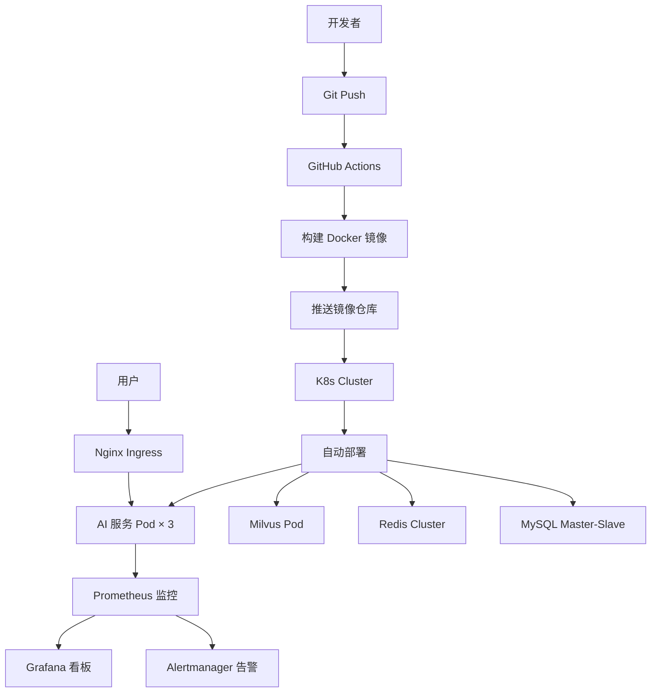

# AI 后端生产环境部署实战：Docker、K8s 与监控告警

> **写在前面：** 开发环境跑通只是第一步，如何将 AI 应用安全、稳定、高效地部署到生产环境才是关键。本文详细讲解 Docker 容器化、Kubernetes 编排、CI/CD 流水线、监控告警体系的生产级部署方案，包含完整的配置文件和最佳实践！

---

## 📋 目录

- [一、部署架构概览](#一部署架构概览)
- [二、Docker 容器化](#二docker-容器化)
- [三、Docker Compose 编排](#三docker-compose-编排)
- [四、Kubernetes 部署](#四kubernetes-部署)
- [五、CI/CD 流水线](#五cicd-流水线)
- [六、配置管理](#六配置管理)
- [七、监控告警体系](#七监控告警体系)
- [八、日志收集](#八日志收集)
- [九、安全加固](#九安全加固)
- [十、性能调优](#十性能调优)

---

## 一、部署架构概览

### 1.1 完整部署架构



---

### 1.2 环境划分

| 环境 | 用途 | 副本数 | 资源配置 |
|------|------|-------|---------|
| **开发环境** | 日常开发 | 1 | 1C2G |
| **测试环境** | 功能测试 | 2 | 2C4G |
| **预发环境** | 上线前验证 | 2 | 2C4G |
| **生产环境** | 线上服务 | 3+ | 4C8G |

---

## 二、Docker 容器化

### 2.1 Dockerfile 编写

**多阶段构建（推荐）：**

```dockerfile
# ========== 构建阶段 ==========
FROM maven:3.9-eclipse-temurin-17 AS builder

WORKDIR /app

# 复制 pom.xml（利用 Docker 缓存）
COPY pom.xml .
RUN mvn dependency:go-offline -B

# 复制源代码
COPY src ./src
RUN mvn clean package -DskipTests

# ========== 运行阶段 ==========
FROM eclipse-temurin:17-jre-alpine

WORKDIR /app

# 安装必要工具
RUN apk add --no-cache curl tini

# 创建非 root 用户
RUN addgroup -S appgroup && adduser -S appuser -G appgroup

# 复制构建产物
COPY --from=builder /app/target/*.jar app.jar

# 设置时区
ENV TZ=Asia/Shanghai
RUN ln -snf /usr/share/zoneinfo/$TZ /etc/localtime && echo $TZ > /etc/timezone

# 设置 JVM 参数
ENV JAVA_OPTS="-Xms512m -Xmx1024m \
               -XX:+UseG1GC \
               -XX:MaxGCPauseMillis=200 \
               -XX:+HeapDumpOnOutOfMemoryError \
               -XX:HeapDumpPath=/app/logs"

# 暴露端口
EXPOSE 8080

# 切换到非 root 用户
USER appuser

# 健康检查
HEALTHCHECK --interval=30s --timeout=3s --start-period=60s --retries=3 \
  CMD curl -f http://localhost:8080/actuator/health || exit 1

# 使用 tini 作为 init 系统
ENTRYPOINT ["tini", "--"]
CMD ["java", "${JAVA_OPTS}", "-jar", "app.jar"]
```

---

### 2.2 .dockerignore 文件

```gitignore
# Git
.git
.gitignore

# IDE
.idea
.vscode
*.iml

# Maven
target/
!.mvn/wrapper/maven-wrapper.jar

# Logs
logs/
*.log

# OS
.DS_Store
Thumbs.db

# Docker
Dockerfile
docker-compose.yml
```

---

### 2.3 构建和推送

**构建脚本：**

```bash
#!/bin/bash
# build.sh

VERSION=${1:-latest}
IMAGE_NAME="registry.example.com/ai-service"

echo "Building image: ${IMAGE_NAME}:${VERSION}"

# 构建
docker build -t ${IMAGE_NAME}:${VERSION} .

# 打标签
docker tag ${IMAGE_NAME}:${VERSION} ${IMAGE_NAME}:latest

# 推送
docker push ${IMAGE_NAME}:${VERSION}
docker push ${IMAGE_NAME}:latest

echo "Image pushed successfully!"
```

**执行：**

```bash
chmod +x build.sh
./build.sh v1.0.0
```

---

## 三、Docker Compose 编排

### 3.1 完整 docker-compose.yml

```yaml
version: '3.8'

services:
  # ========== AI 服务 ==========
  ai-service:
    build:
      context: .
      dockerfile: Dockerfile
    image: ai-service:latest
    container_name: ai-service
    ports:
      - "8080:8080"
    environment:
      - SPRING_PROFILES_ACTIVE=prod
      - DB_HOST=mysql
      - REDIS_HOST=redis
      - MILVUS_HOST=milvus
      - DASHSCOPE_API_KEY=${DASHSCOPE_API_KEY}
    volumes:
      - ./logs:/app/logs
      - ./config:/app/config
    depends_on:
      mysql:
        condition: service_healthy
      redis:
        condition: service_healthy
      milvus:
        condition: service_healthy
    networks:
      - ai-network
    deploy:
      resources:
        limits:
          cpus: '2'
          memory: 4G
        reservations:
          cpus: '1'
          memory: 2G
    restart: unless-stopped
    healthcheck:
      test: ["CMD", "curl", "-f", "http://localhost:8080/actuator/health"]
      interval: 30s
      timeout: 10s
      retries: 3
      start_period: 60s

  # ========== MySQL ==========
  mysql:
    image: mysql:8.0
    container_name: mysql
    environment:
      MYSQL_ROOT_PASSWORD: ${DB_ROOT_PASSWORD}
      MYSQL_DATABASE: ai_db
      MYSQL_USER: ai_user
      MYSQL_PASSWORD: ${DB_PASSWORD}
    ports:
      - "3306:3306"
    volumes:
      - mysql-data:/var/lib/mysql
      - ./init-db:/docker-entrypoint-initdb.d
    command:
      - --character-set-server=utf8mb4
      - --collation-server=utf8mb4_unicode_ci
      - --max-connections=1000
    networks:
      - ai-network
    healthcheck:
      test: ["CMD", "mysqladmin", "ping", "-h", "localhost"]
      interval: 10s
      timeout: 5s
      retries: 5
    restart: unless-stopped

  # ========== Redis ==========
  redis:
    image: redis:7-alpine
    container_name: redis
    ports:
      - "6379:6379"
    volumes:
      - redis-data:/data
    command: redis-server --appendonly yes --requirepass ${REDIS_PASSWORD}
    networks:
      - ai-network
    healthcheck:
      test: ["CMD", "redis-cli", "ping"]
      interval: 10s
      timeout: 5s
      retries: 5
    restart: unless-stopped

  # ========== Milvus ==========
  milvus:
    image: milvusdb/milvus:v2.3.0
    container_name: milvus
    ports:
      - "19530:19530"
      - "9091:9091"
    volumes:
      - milvus-data:/var/lib/milvus
    environment:
      ETCD_ENDPOINTS: etcd:2379
      MINIO_ADDRESS: minio:9000
    depends_on:
      - etcd
      - minio
    networks:
      - ai-network
    restart: unless-stopped

  etcd:
    image: quay.io/coreos/etcd:v3.5.5
    container_name: milvus-etcd
    environment:
      ETCD_AUTO_COMPACTION_MODE: revision
      ETCD_AUTO_COMPACTION_RETENTION: "1000"
      ETCD_QUOTA_BACKEND_BYTES: "4294967296"
    volumes:
      - etcd-data:/etcd
    command: etcd -advertise-client-urls=http://etcd:2379 -listen-client-urls http://0.0.0.0:2379 --data-dir /etcd
    networks:
      - ai-network
    restart: unless-stopped

  minio:
    image: minio/minio:RELEASE.2023-03-20T20-16-18Z
    container_name: milvus-minio
    environment:
      MINIO_ACCESS_KEY: minioadmin
      MINIO_SECRET_KEY: minioadmin
    volumes:
      - minio-data:/minio_data
    command: minio server /minio_data
    networks:
      - ai-network
    restart: unless-stopped

  # ========== Prometheus ==========
  prometheus:
    image: prom/prometheus:latest
    container_name: prometheus
    ports:
      - "9090:9090"
    volumes:
      - ./monitoring/prometheus.yml:/etc/prometheus/prometheus.yml
      - prometheus-data:/prometheus
    command:
      - '--config.file=/etc/prometheus/prometheus.yml'
      - '--storage.tsdb.path=/prometheus'
    networks:
      - ai-network
    restart: unless-stopped

  # ========== Grafana ==========
  grafana:
    image: grafana/grafana:latest
    container_name: grafana
    ports:
      - "3000:3000"
    environment:
      GF_SECURITY_ADMIN_PASSWORD: ${GRAFANA_PASSWORD}
    volumes:
      - grafana-data:/var/lib/grafana
      - ./monitoring/grafana/dashboards:/etc/grafana/provisioning/dashboards
    depends_on:
      - prometheus
    networks:
      - ai-network
    restart: unless-stopped

volumes:
  mysql-data:
  redis-data:
  milvus-data:
  etcd-data:
  minio-data:
  prometheus-data:
  grafana-data:

networks:
  ai-network:
    driver: bridge
```

---

### 3.2 环境变量文件

**.env 文件：**

```bash
# 数据库
DB_ROOT_PASSWORD=your_root_password
DB_PASSWORD=your_db_password

# Redis
REDIS_PASSWORD=your_redis_password

# 大模型 API
DASHSCOPE_API_KEY=sk-your-api-key

# Grafana
GRAFANA_PASSWORD=admin123
```

**启动命令：**

```bash
# 加载环境变量
export $(cat .env | xargs)

# 启动所有服务
docker-compose up -d

# 查看日志
docker-compose logs -f ai-service

# 停止服务
docker-compose down

# 停止并删除数据卷（谨慎使用）
docker-compose down -v
```

---

## 四、Kubernetes 部署

### 4.1 Namespace 配置

```yaml
# namespace.yaml
apiVersion: v1
kind: Namespace
metadata:
  name: ai-production
  labels:
    name: ai-production
```

---

### 4.2 ConfigMap 配置

```yaml
# configmap.yaml
apiVersion: v1
kind: ConfigMap
metadata:
  name: ai-service-config
  namespace: ai-production
data:
  application-prod.yml: |
    server:
      port: 8080
    
    spring:
      datasource:
        url: jdbc:mysql://mysql-service:3306/ai_db?useSSL=false&serverTimezone=Asia/Shanghai
        username: ai_user
        password: ${DB_PASSWORD}
      
      redis:
        host: redis-service
        port: 6379
        password: ${REDIS_PASSWORD}
    
    milvus:
      host: milvus-service
      port: 19530
    
    management:
      endpoints:
        web:
          exposure:
            include: health,info,prometheus,metrics
      metrics:
        export:
          prometheus:
            enabled: true
```

---

### 4.3 Secret 管理

```yaml
# secret.yaml
apiVersion: v1
kind: Secret
metadata:
  name: ai-service-secret
  namespace: ai-production
type: Opaque
stringData:
  DB_PASSWORD: your_db_password
  REDIS_PASSWORD: your_redis_password
  DASHSCOPE_API_KEY: sk-your-api-key
  GRAFANA_PASSWORD: admin123
```

**注意：** 生产环境建议使用 Vault 或 AWS Secrets Manager

---

### 4.4 Deployment 配置

```yaml
# deployment.yaml
apiVersion: apps/v1
kind: Deployment
metadata:
  name: ai-service
  namespace: ai-production
  labels:
    app: ai-service
spec:
  replicas: 3
  selector:
    matchLabels:
      app: ai-service
  strategy:
    type: RollingUpdate
    rollingUpdate:
      maxSurge: 1
      maxUnavailable: 0
  template:
    metadata:
      labels:
        app: ai-service
      annotations:
        prometheus.io/scrape: "true"
        prometheus.io/port: "8080"
        prometheus.io/path: "/actuator/prometheus"
    spec:
      containers:
      - name: ai-service
        image: registry.example.com/ai-service:v1.0.0
        imagePullPolicy: Always
        ports:
        - containerPort: 8080
          name: http
          protocol: TCP
        
        env:
        - name: SPRING_PROFILES_ACTIVE
          value: "prod"
        - name: DB_PASSWORD
          valueFrom:
            secretKeyRef:
              name: ai-service-secret
              key: DB_PASSWORD
        - name: REDIS_PASSWORD
          valueFrom:
            secretKeyRef:
              name: ai-service-secret
              key: REDIS_PASSWORD
        - name: DASHSCOPE_API_KEY
          valueFrom:
            secretKeyRef:
              name: ai-service-secret
              key: DASHSCOPE_API_KEY
        
        resources:
          requests:
            cpu: "1"
            memory: "2Gi"
          limits:
            cpu: "2"
            memory: "4Gi"
        
        livenessProbe:
          httpGet:
            path: /actuator/health/liveness
            port: 8080
          initialDelaySeconds: 60
          periodSeconds: 10
          timeoutSeconds: 3
          failureThreshold: 3
        
        readinessProbe:
          httpGet:
            path: /actuator/health/readiness
            port: 8080
          initialDelaySeconds: 30
          periodSeconds: 5
          timeoutSeconds: 3
          failureThreshold: 3
        
        volumeMounts:
        - name: config-volume
          mountPath: /app/config
        - name: logs-volume
          mountPath: /app/logs
      
      volumes:
      - name: config-volume
        configMap:
          name: ai-service-config
      - name: logs-volume
        emptyDir: {}
      
      restartPolicy: Always
```

---

### 4.5 Service 配置

```yaml
# service.yaml
apiVersion: v1
kind: Service
metadata:
  name: ai-service
  namespace: ai-production
  labels:
    app: ai-service
spec:
  type: ClusterIP
  selector:
    app: ai-service
  ports:
  - name: http
    port: 8080
    targetPort: 8080
    protocol: TCP
```

---

### 4.6 Ingress 配置

```yaml
# ingress.yaml
apiVersion: networking.k8s.io/v1
kind: Ingress
metadata:
  name: ai-service-ingress
  namespace: ai-production
  annotations:
    nginx.ingress.kubernetes.io/ssl-redirect: "true"
    nginx.ingress.kubernetes.io/rate-limit: "100"
    cert-manager.io/cluster-issuer: letsencrypt-prod
spec:
  ingressClassName: nginx
  tls:
  - hosts:
    - ai.example.com
    secretName: ai-tls-secret
  rules:
  - host: ai.example.com
    http:
      paths:
      - path: /
        pathType: Prefix
        backend:
          service:
            name: ai-service
            port:
              number: 8080
```

---

### 4.7 HPA 自动扩缩容

```yaml
# hpa.yaml
apiVersion: autoscaling/v2
kind: HorizontalPodAutoscaler
metadata:
  name: ai-service-hpa
  namespace: ai-production
spec:
  scaleTargetRef:
    apiVersion: apps/v1
    kind: Deployment
    name: ai-service
  minReplicas: 3
  maxReplicas: 10
  metrics:
  - type: Resource
    resource:
      name: cpu
      target:
        type: Utilization
        averageUtilization: 70
  - type: Resource
    resource:
      name: memory
      target:
        type: Utilization
        averageUtilization: 80
  behavior:
    scaleUp:
      stabilizationWindowSeconds: 60
      policies:
      - type: Percent
        value: 50
        periodSeconds: 60
    scaleDown:
      stabilizationWindowSeconds: 300
      policies:
      - type: Percent
        value: 10
        periodSeconds: 60
```

---

### 4.8 部署命令

```bash
# 创建命名空间
kubectl apply -f namespace.yaml

# 创建配置
kubectl apply -f configmap.yaml
kubectl apply -f secret.yaml

# 部署应用
kubectl apply -f deployment.yaml
kubectl apply -f service.yaml
kubectl apply -f ingress.yaml
kubectl apply -f hpa.yaml

# 查看状态
kubectl get pods -n ai-production
kubectl get svc -n ai-production
kubectl get ingress -n ai-production

# 查看日志
kubectl logs -f deployment/ai-service -n ai-production

# 滚动更新
kubectl set image deployment/ai-service ai-service=registry.example.com/ai-service:v1.1.0 -n ai-production

# 回滚
kubectl rollout undo deployment/ai-service -n ai-production
```

---

## 五、CI/CD 流水线

### 5.1 GitHub Actions 配置

```yaml
# .github/workflows/deploy.yml
name: Build and Deploy

on:
  push:
    branches: [main]
  pull_request:
    branches: [main]

env:
  REGISTRY: registry.example.com
  IMAGE_NAME: ai-service

jobs:
  build:
    runs-on: ubuntu-latest
    
    steps:
    - name: Checkout code
      uses: actions/checkout@v3
    
    - name: Set up JDK 17
      uses: actions/setup-java@v3
      with:
        java-version: '17'
        distribution: 'temurin'
        cache: maven
    
    - name: Build with Maven
      run: mvn clean package -DskipTests
    
    - name: Run tests
      run: mvn test
    
    - name: Login to Docker Registry
      uses: docker/login-action@v2
      with:
        registry: ${{ env.REGISTRY }}
        username: ${{ secrets.DOCKER_USERNAME }}
        password: ${{ secrets.DOCKER_PASSWORD }}
    
    - name: Build and push Docker image
      uses: docker/build-push-action@v4
      with:
        context: .
        push: true
        tags: |
          ${{ env.REGISTRY }}/${{ env.IMAGE_NAME }}:${{ github.sha }}
          ${{ env.REGISTRY }}/${{ env.IMAGE_NAME }}:latest
  
  deploy:
    needs: build
    runs-on: ubuntu-latest
    if: github.ref == 'refs/heads/main'
    
    steps:
    - name: Checkout code
      uses: actions/checkout@v3
    
    - name: Configure kubectl
      uses: azure/k8s-set-context@v3
      with:
        kubeconfig: ${{ secrets.KUBE_CONFIG }}
    
    - name: Deploy to Kubernetes
      run: |
        kubectl set image deployment/ai-service \
          ai-service=${{ env.REGISTRY }}/${{ env.IMAGE_NAME }}:${{ github.sha }} \
          -n ai-production
        
        kubectl rollout status deployment/ai-service -n ai-production --timeout=300s
    
    - name: Verify deployment
      run: |
        kubectl get pods -n ai-production
        kubectl get svc -n ai-production
```

---

## 六、配置管理

### 6.1 Spring Cloud Config

**Config Server：**

```yaml
# application.yml
spring:
  cloud:
    config:
      server:
        git:
          uri: https://github.com/example/config-repo
          username: ${GIT_USERNAME}
          password: ${GIT_PASSWORD}
```

**客户端配置：**

```yaml
# bootstrap.yml
spring:
  application:
    name: ai-service
  cloud:
    config:
      uri: http://config-server:8888
      profile: prod
      label: main
```

---

### 6.2 配置刷新

```java
@RestController
@RefreshScope
public class ConfigController {
    
    @Value("${llm.temperature:0.7}")
    private Double temperature;
    
    @GetMapping("/config/temperature")
    public Double getTemperature() {
        return temperature;
    }
}

// 触发刷新
curl -X POST http://localhost:8080/actuator/refresh
```

---

## 七、监控告警体系

### 7.1 Prometheus 配置

```yaml
# monitoring/prometheus.yml
global:
  scrape_interval: 15s
  evaluation_interval: 15s

scrape_configs:
  - job_name: 'ai-service'
    metrics_path: '/actuator/prometheus'
    static_configs:
      - targets: ['ai-service:8080']
  
  - job_name: 'prometheus'
    static_configs:
      - targets: ['localhost:9090']
```

---

### 7.2 Grafana 看板

**导入 Dashboard：**

1. 访问 Grafana：http://localhost:3000
2. 导入 JVM Micrometer dashboard（ID: 4701）
3. 导入 Spring Boot dashboard（ID: 11378）
4. 自定义 AI 业务指标看板

**关键指标：**

- QPS（每秒请求数）
- 响应时间（P50/P95/P99）
- 错误率
- Token 消耗量
- API 调用成本
- 缓存命中率

---

### 7.3 Alertmanager 告警

```yaml
# monitoring/alertmanager.yml
route:
  group_by: ['alertname']
  group_wait: 10s
  group_interval: 10s
  repeat_interval: 1h
  receiver: 'web.hook'

receivers:
  - name: 'web.hook'
    webhook_configs:
      - url: 'http://dingtalk-webhook:8060/dingtalk/webhook/send'

alerting:
  alertmanagers:
    - static_configs:
        - targets:
          - alertmanager:9093
```

**告警规则：**

```yaml
# monitoring/rules.yml
groups:
  - name: ai-service-alerts
    rules:
    - alert: HighErrorRate
      expr: rate(http_server_requests_seconds_count{status=~"5.."}[5m]) > 0.1
      for: 5m
      labels:
        severity: critical
      annotations:
        summary: "高错误率"
        description: "错误率超过 10%"
    
    - alert: HighResponseTime
      expr: histogram_quantile(0.95, rate(http_server_requests_seconds_bucket[5m])) > 2
      for: 5m
      labels:
        severity: warning
      annotations:
        summary: "响应时间过高"
        description: "P95 响应时间超过 2 秒"
    
    - alert: HighTokenUsage
      expr: rate(llm_tokens_total[1h]) > 100000
      for: 10m
      labels:
        severity: warning
      annotations:
        summary: "Token 消耗过高"
        description: "每小时 Token 消耗超过 10 万"
```

---

## 八、日志收集

### 8.1 ELK Stack 配置

**Filebeat 配置：**

```yaml
# filebeat.yml
filebeat.inputs:
  - type: log
    enabled: true
    paths:
      - /app/logs/*.log
    fields:
      app: ai-service
      env: production
    multiline.pattern: '^[0-9]{4}-[0-9]{2}-[0-9]{2}'
    multiline.negate: true
    multiline.match: after

output.elasticsearch:
  hosts: ["elasticsearch:9200"]
  index: "ai-service-%{+yyyy.MM.dd}"
```

**Kibana 查询：**

```kibana
# 查询错误日志
level: ERROR AND app: ai-service

# 统计错误类型
level: ERROR | stats count() by exception_type

# 慢查询日志
message: "*slow*" AND duration_ms > 1000
```

---

## 九、安全加固

### 9.1 HTTPS 配置

**Nginx Ingress TLS：**

```yaml
apiVersion: cert-manager.io/v1
kind: Certificate
metadata:
  name: ai-tls
  namespace: ai-production
spec:
  secretName: ai-tls-secret
  issuerRef:
    name: letsencrypt-prod
    kind: ClusterIssuer
  dnsNames:
    - ai.example.com
```

---

### 9.2 网络策略

```yaml
# network-policy.yaml
apiVersion: networking.k8s.io/v1
kind: NetworkPolicy
metadata:
  name: ai-service-policy
  namespace: ai-production
spec:
  podSelector:
    matchLabels:
      app: ai-service
  policyTypes:
  - Ingress
  - Egress
  ingress:
  - from:
    - podSelector:
        matchLabels:
          app: api-gateway
    ports:
    - protocol: TCP
      port: 8080
  egress:
  - to:
    - podSelector:
        matchLabels:
          app: mysql
    ports:
    - protocol: TCP
      port: 3306
  - to:
    - podSelector:
        matchLabels:
          app: redis
    ports:
    - protocol: TCP
      port: 6379
```

---

### 9.3 RBAC 权限控制

```yaml
# rbac.yaml
apiVersion: rbac.authorization.k8s.io/v1
kind: Role
metadata:
  name: ai-service-role
  namespace: ai-production
rules:
  - apiGroups: [""]
    resources: ["pods", "services"]
    verbs: ["get", "list"]

---
apiVersion: rbac.authorization.k8s.io/v1
kind: RoleBinding
metadata:
  name: ai-service-binding
  namespace: ai-production
subjects:
  - kind: ServiceAccount
    name: ai-service-sa
roleRef:
  kind: Role
  name: ai-service-role
  apiGroup: rbac.authorization.k8s.io
```

---

## 十、性能调优

### 10.1 JVM 参数优化

```bash
JAVA_OPTS="-Xms2g -Xmx2g \
           -XX:+UseG1GC \
           -XX:MaxGCPauseMillis=200 \
           -XX:InitiatingHeapOccupancyPercent=35 \
           -XX:G1ReservePercent=15 \
           -XX:MaxMetaspaceSize=512m \
           -XX:+ParallelRefProcEnabled \
           -XX:+UnlockExperimentalVMOptions \
           -XX:+UseContainerSupport"
```

---

### 10.2 连接池优化

```yaml
spring:
  datasource:
    hikari:
      maximum-pool-size: 20
      minimum-idle: 5
      connection-timeout: 30000
      idle-timeout: 600000
      max-lifetime: 1800000
  
  redis:
    lettuce:
      pool:
        max-active: 50
        max-idle: 20
        min-idle: 5
        max-wait: 3000ms
```

---

### 10.3 Linux 内核优化

```bash
# /etc/sysctl.conf
net.core.somaxconn = 65535
net.ipv4.tcp_max_syn_backlog = 65535
net.ipv4.ip_local_port_range = 1024 65535
net.ipv4.tcp_fin_timeout = 15
net.ipv4.tcp_keepalive_time = 300

# 生效
sysctl -p
```

---

## 💡 总结

### 部署检查清单

- [ ] Docker 镜像构建成功
- [ ] 环境变量配置正确
- [ ] 健康检查通过
- [ ] 监控指标采集正常
- [ ] 日志收集正常
- [ ] HTTPS 证书有效
- [ ] 备份策略配置
- [ ] 灾难恢复演练

### 最佳实践

1. **不可变基础设施：** 每次部署新镜像，不修改运行中容器
2. **蓝绿部署：** 零停机升级
3. **灰度发布：** 逐步放量验证
4. **自动化运维：** IaC（Infrastructure as Code）
5. **持续监控：** 可观测性三位一体（Metrics、Logs、Traces）

---

*最后更新: 2026-05-17*

*作者：洛苡苑香 | Java 工程师转型 AI 应用开发中*
