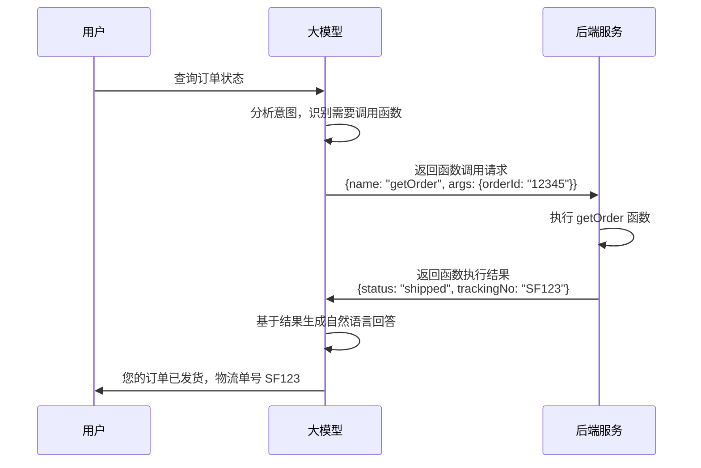

# 大模型 Function Call 实战：让 AI 自主调用后端业务接口

> **写在前面：** Function Call（函数调用）是大模型的一项革命性能力，它让 AI 不再只是"聊天机器人"，而是能够主动调用后端业务接口的"智能助手"。本文详细讲解如何在 Java 后端实现 Function Call，让 AI 可以查询订单、统计数据、执行运维操作，打造真正的智能业务系统！

---

## 📋 目录

- [一、什么是 Function Call](#一什么是-function-call)
- [二、Function Call 应用场景](#二function-call-应用场景)
- [三、Function Call 运行机制详解](#三function-call-运行机制详解)
- [四、通义千问 Function Call 接入](#四通义千问-function-call-接入)
- [五、Java 后端实现完整流程](#五java-后端实现完整流程)
- [六、实战案例 1：智能订单查询](#六实战案例-1智能订单查询)
- [七、实战案例 2：业务数据统计](#七实战案例-2业务数据统计)
- [八、实战案例 3：简易运维操作](#八实战案例-3简易运维操作)
- [九、多函数串行调用与编排](#九多函数串行调用与编排)
- [十、安全控制与权限管理](#十安全控制与权限管理)
- [十一、性能优化与最佳实践](#十一性能优化与最佳实践)

---

## 一、什么是 Function Call

### 1.1 核心概念

**Function Call（函数调用）** 是大模型的一种能力，允许模型在对话过程中主动调用外部函数或 API，获取实时数据或执行业务操作。

**传统对话 vs Function Call：**

```
【传统对话】
用户：我的订单状态是什么？
AI：我无法访问您的订单信息，请登录系统查看。

【Function Call】
用户：我的订单状态是什么？
AI：[识别需要调用 getOrderStatus 函数]
    [调用后端 API 获取订单信息]
    [基于返回结果生成回答]
AI：您的订单 #12345 已发货，预计明天送达。
```

---

### 1.2 核心价值

| 维度 | 传统 AI | Function Call AI |
|------|---------|------------------|
| **数据时效性** | ❌ 训练数据（过时） | ✅ 实时数据 |
| **业务能力** | ❌ 只能聊天 | ✅ 可执行业务操作 |
| **准确性** | ❌ 可能编造 | ✅ 基于真实数据 |
| **应用场景** | 有限 | 无限扩展 |

---

### 1.3 支持 Function Call 的模型

| 模型 | 支持情况 | 备注 |
|------|---------|------|
| **通义千问** | ✅ 完美支持 | qwen-turbo、qwen-plus、qwen-max |
| **GPT-4/GPT-3.5** | ✅ 完美支持 | OpenAI 原生支持 |
| **Claude** | ⚠️ 部分支持 | 通过 Prompt 模拟 |
| **Llama3** | ❌ 不支持 | 需自行实现 |
| **Qwen2（本地）** | ✅ 支持 | Ollama 0.1.30+ |

---

## 二、Function Call 应用场景

### 2.1 典型应用场景

#### 场景 1：智能客服

```
用户：帮我查一下订单 #12345 的状态
AI：[调用 getOrder 接口]
AI：您的订单已发货，物流单号 SF123456789

用户：取消这个订单
AI：[调用 cancelOrder 接口，需要二次确认]
AI：确定要取消订单 #12345 吗？此操作不可恢复。
```

---

#### 场景 2：数据分析助手

```
用户：上个月销售额是多少？
AI：[调用 getSalesStats 接口]
AI：上月销售额为 1,234,567 元，环比增长 15%

用户：哪个品类卖得最好？
AI：[调用 getCategoryStats 接口]
AI：电子产品销售额最高，占比 45%
```

---

#### 场景 3：智能运维

```
用户：检查服务器状态
AI：[调用 checkServerStatus 接口]
AI：服务器运行正常，CPU 使用率 45%，内存使用率 62%

用户：重启测试环境
AI：[调用 restartService 接口，需要权限验证]
AI：已重启测试环境服务，耗时 15 秒
```

---

#### 场景 4：个性化推荐

```
用户：我想买一台笔记本电脑
AI：[调用 getUserProfile 接口获取用户偏好]
AI：[调用 searchProducts 接口搜索商品]
AI：根据您的预算和使用习惯，推荐以下 3 款笔记本...
```

---

### 2.2 不适合的场景

❌ **高风险操作：**
- 删除核心数据
- 修改系统配置
- 转账支付（需人工确认）

❌ **复杂业务流程：**
- 多步骤审批
- 涉及多个系统的联动操作

❌ **需要人类判断的场景：**
- 内容审核
- 风险评估

---

## 三、Function Call 运行机制详解

### 3.1 完整工作流程



---

### 3.2 关键技术点

**1. 函数描述（Function Schema）**

告诉大模型有哪些函数可用，每个函数的参数是什么：

```json
{
  "name": "getOrder",
  "description": "查询订单信息",
  "parameters": {
    "type": "object",
    "properties": {
      "orderId": {
        "type": "string",
        "description": "订单ID"
      }
    },
    "required": ["orderId"]
  }
}
```

**2. 函数调用识别**

大模型根据用户问题，判断是否需要调用函数，以及调用哪个函数。

**3. 参数提取**

从用户问题中提取函数所需的参数。

**4. 函数执行**

后端执行对应的业务逻辑，返回结果。

**5. 结果整合**

大模型将函数返回结果整合成自然语言回答。

---

## 四、通义千问 Function Call 接入

### 4.1 Maven 依赖

```xml
<dependency>
    <groupId>dev.langchain4j</groupId>
    <artifactId>langchain4j-dashscope</artifactId>
    <version>0.26.0</version>
</dependency>
```

---

### 4.2 定义函数工具

```java
package com.example.tool;

import dev.langchain4j.agent.tool.Tool;
import dev.langchain4j.agent.tool.ToolParam;
import lombok.extern.slf4j.Slf4j;
import org.springframework.stereotype.Component;

/**
 * 订单查询工具
 */
@Slf4j
@Component
public class OrderTool {

    /**
     * 查询订单信息
     */
    @Tool("查询订单详细信息，包括状态、金额、物流等")
    public String getOrder(
            @ToolParam("订单ID") String orderId) {
        
        log.info("调用 getOrder 工具: orderId={}", orderId);
        
        // TODO: 调用实际的业务服务
        // Order order = orderService.getOrder(orderId);
        
        // 模拟返回
        return String.format("""
            {
              "orderId": "%s",
              "status": "shipped",
              "amount": 299.00,
              "trackingNo": "SF123456789",
              "estimatedDelivery": "2026-05-18"
            }
            """, orderId);
    }

    /**
     * 取消订单
     */
    @Tool("取消未发货的订单")
    public String cancelOrder(
            @ToolParam("订单ID") String orderId) {
        
        log.info("调用 cancelOrder 工具: orderId={}", orderId);
        
        // TODO: 实际业务逻辑
        
        return String.format("""
            {
              "orderId": "%s",
              "success": true,
              "message": "订单已取消"
            }
            """, orderId);
    }
}
```

---

### 4.3 配置带工具的 ChatModel

```java
package com.example.config;

import dev.langchain4j.agent.tool.ToolSpecification;
import dev.langchain4j.model.chat.ChatLanguageModel;
import dev.langchain4j.model.dashscope.DashScopeChatModel;
import dev.langchain4j.service.AiServices;
import org.springframework.beans.factory.annotation.Value;
import org.springframework.context.annotation.Bean;
import org.springframework.context.annotation.Configuration;

@Configuration
public class AiConfig {

    @Value("${dashscope.api.key}")
    private String apiKey;

    @Bean
    public ChatLanguageModel chatModel() {
        return DashScopeChatModel.builder()
            .apiKey(apiKey)
            .modelName("qwen-plus")  // 支持 Function Call
            .temperature(0.7)
            .build();
    }
}
```

---

## 五、Java 后端实现完整流程

### 5.1 方式 1：使用 LangChain4j AiServices（推荐）

**定义 AI Service 接口：**

```java
package com.example.service;

import dev.langchain4j.service.SystemMessage;
import dev.langchain4j.service.UserMessage;

/**
 * 智能助手服务
 */
public interface AssistantService {

    @SystemMessage("你是一个智能客服助手，可以帮助用户查询订单、取消订单等。")
    String chat(@UserMessage String userMessage);
}
```

---

**创建 Service Bean：**

```java
package com.example.service;

import com.example.tool.OrderTool;
import dev.langchain4j.memory.chat.MessageWindowChatMemory;
import dev.langchain4j.model.chat.ChatLanguageModel;
import dev.langchain4j.service.AiServices;
import lombok.RequiredArgsConstructor;
import org.springframework.context.annotation.Bean;
import org.springframework.context.annotation.Configuration;

@Configuration
@RequiredArgsConstructor
public class AssistantConfig {

    private final ChatLanguageModel chatModel;
    private final OrderTool orderTool;

    @Bean
    public AssistantService assistantService() {
        return AiServices.builder(AssistantService.class)
            .chatLanguageModel(chatModel)
            .tools(orderTool)  // 注册工具
            .chatMemoryProvider(memoryId -> 
                MessageWindowChatMemory.withMaxMessages(10))
            .build();
    }
}
```

---

**Controller 调用：**

```java
package com.example.controller;

import com.example.service.AssistantService;
import lombok.RequiredArgsConstructor;
import org.springframework.web.bind.annotation.*;

@RestController
@RequestMapping("/api/assistant")
@RequiredArgsConstructor
public class AssistantController {

    private final AssistantService assistantService;

    @PostMapping("/chat")
    public String chat(@RequestBody ChatRequest request) {
        return assistantService.chat(request.getMessage());
    }
}
```

---

### 5.2 方式 2：手动处理 Function Call

**完整流程实现：**

```java
package com.example.service;

import com.alibaba.dashscope.aigc.generation.Generation;
import com.alibaba.dashscope.aigc.generation.GenerationParam;
import com.alibaba.dashscope.aigc.generation.GenerationResult;
import com.alibaba.dashscope.common.Message;
import com.alibaba.dashscope.common.Role;
import com.fasterxml.jackson.databind.JsonNode;
import com.fasterxml.jackson.databind.ObjectMapper;
import lombok.RequiredArgsConstructor;
import lombok.extern.slf4j.Slf4j;
import org.springframework.stereotype.Service;

import java.util.*;

@Slf4j
@Service
@RequiredArgsConstructor
public class ManualFunctionCallService {

    private final Generation generation;
    private final ObjectMapper objectMapper;
    private final OrderTool orderTool;

    /**
     * 处理带 Function Call 的对话
     */
    public String chat(String userMessage) {
        List<Message> messages = new ArrayList<>();
        
        // 1. 添加用户消息
        messages.add(Message.builder()
            .role(Role.USER.getValue())
            .content(userMessage)
            .build());

        // 2. 第一次调用：判断是否需要调用函数
        GenerationResult result = callWithTools(messages);
        
        // 3. 检查是否有函数调用
        Optional<Map<String, Object>> functionCall = extractFunctionCall(result);
        
        if (functionCall.isPresent()) {
            // 4. 执行函数
            Map<String, Object> callInfo = functionCall.get();
            String functionName = (String) callInfo.get("name");
            Map<String, Object> arguments = (Map<String, Object>) callInfo.get("arguments");
            
            String functionResult = executeFunction(functionName, arguments);
            
            // 5. 将函数结果添加到消息列表
            messages.add(Message.builder()
                .role(Role.ASSISTANT.getValue())
                .content("")
                .functionCall(callInfo)
                .build());
            
            messages.add(Message.builder()
                .role(Role.FUNCTION.getValue())
                .name(functionName)
                .content(functionResult)
                .build());
            
            // 6. 第二次调用：生成最终回答
            result = callWithoutTools(messages);
        }
        
        // 7. 返回最终回答
        return result.getOutput().getChoices().get(0).getMessage().getContent();
    }

    /**
     * 带工具的调用
     */
    private GenerationResult callWithTools(List<Message> messages) {
        GenerationParam param = GenerationParam.builder()
            .model("qwen-plus")
            .messages(messages)
            .tools(buildToolSpecifications())
            .build();
        
        try {
            return generation.call(param);
        } catch (Exception e) {
            throw new RuntimeException("调用失败", e);
        }
    }

    /**
     * 不带工具的调用
     */
    private GenerationResult callWithoutTools(List<Message> messages) {
        GenerationParam param = GenerationParam.builder()
            .model("qwen-plus")
            .messages(messages)
            .build();
        
        try {
            return generation.call(param);
        } catch (Exception e) {
            throw new RuntimeException("调用失败", e);
        }
    }

    /**
     * 构建工具规范
     */
    private List<Map<String, Object>> buildToolSpecifications() {
        List<Map<String, Object>> tools = new ArrayList<>();
        
        // getOrder 工具
        Map<String, Object> getOrderTool = new HashMap<>();
        getOrderTool.put("type", "function");
        
        Map<String, Object> function = new HashMap<>();
        function.put("name", "getOrder");
        function.put("description", "查询订单详细信息");
        
        Map<String, Object> parameters = new HashMap<>();
        parameters.put("type", "object");
        
        Map<String, Object> properties = new HashMap<>();
        Map<String, Object> orderIdProp = new HashMap<>();
        orderIdProp.put("type", "string");
        orderIdProp.put("description", "订单ID");
        properties.put("orderId", orderIdProp);
        
        parameters.put("properties", properties);
        parameters.put("required", Arrays.asList("orderId"));
        
        function.put("parameters", parameters);
        getOrderTool.put("function", function);
        
        tools.add(getOrderTool);
        
        return tools;
    }

    /**
     * 提取函数调用信息
     */
    private Optional<Map<String, Object>> extractFunctionCall(GenerationResult result) {
        // 解析响应，提取 function_call
        // 具体实现取决于 SDK 版本
        return Optional.empty();
    }

    /**
     * 执行函数
     */
    private String executeFunction(String functionName, Map<String, Object> arguments) {
        return switch (functionName) {
            case "getOrder" -> orderTool.getOrder((String) arguments.get("orderId"));
            case "cancelOrder" -> orderTool.cancelOrder((String) arguments.get("orderId"));
            default -> throw new IllegalArgumentException("未知函数: " + functionName);
        };
    }
}
```

---

## 六、实战案例 1：智能订单查询

### 6.1 业务需求

用户可以用自然语言查询订单信息，例如：
- "我的订单 #12345 状态如何？"
- "帮我查一下昨天的订单"
- "显示我最近的 3 个订单"

---

### 6.2 工具实现

```java
@Component
@Slf4j
public class OrderQueryTool {

    @Autowired
    private OrderService orderService;

    @Tool("根据订单ID查询订单详细信息")
    public String getOrderById(@ToolParam("订单ID") String orderId) {
        try {
            Order order = orderService.getOrderById(orderId);
            if (order == null) {
                return "{\"error\": \"订单不存在\"}";
            }
            
            return objectMapper.writeValueAsString(Map.of(
                "orderId", order.getId(),
                "status", order.getStatus(),
                "amount", order.getAmount(),
                "createTime", order.getCreateTime(),
                "items", order.getItems()
            ));
        } catch (Exception e) {
            log.error("查询订单失败", e);
            return "{\"error\": \"查询失败\"}";
        }
    }

    @Tool("查询用户的订单列表")
    public String getUserOrders(
            @ToolParam("用户ID") String userId,
            @ToolParam("数量，默认5") Integer limit) {
        
        try {
            List<Order> orders = orderService.getUserOrders(userId, limit);
            return objectMapper.writeValueAsString(orders);
        } catch (Exception e) {
            log.error("查询订单列表失败", e);
            return "{\"error\": \"查询失败\"}";
        }
    }
}
```

---

### 6.3 测试效果

**用户输入：**
```
帮我查一下订单 ORD20260517001 的状态
```

**AI 输出：**
```
[调用 getOrderById 函数]
[获取订单信息]

您的订单 ORD20260517001 状态为"已发货"，金额 299 元，
物流单号 SF123456789，预计明天送达。
```

---

## 七、实战案例 2：业务数据统计

### 7.1 统计工具实现

```java
@Component
@Slf4j
public class StatisticsTool {

    @Autowired
    private StatisticsService statisticsService;

    @Tool("查询指定时间段的销售统计数据")
    public String getSalesStats(
            @ToolParam("开始日期，格式 yyyy-MM-dd") String startDate,
            @ToolParam("结束日期，格式 yyyy-MM-dd") String endDate) {
        
        try {
            SalesStats stats = statisticsService.getSalesStats(startDate, endDate);
            return objectMapper.writeValueAsString(stats);
        } catch (Exception e) {
            log.error("查询销售统计失败", e);
            return "{\"error\": \"查询失败\"}";
        }
    }

    @Tool("查询各品类的销售占比")
    public String getCategoryStats(
            @ToolParam("时间段：today/yesterday/last_week/last_month") String period) {
        
        try {
            List<CategoryStats> stats = statisticsService.getCategoryStats(period);
            return objectMapper.writeValueAsString(stats);
        } catch (Exception e) {
            log.error("查询品类统计失败", e);
            return "{\"error\": \"查询失败\"}";
        }
    }
}
```

---

### 7.2 测试效果

**用户输入：**
```
上个月的销售额是多少？哪个品类卖得最好？
```

**AI 输出：**
```
[调用 getSalesStats 函数，period="last_month"]
[调用 getCategoryStats 函数，period="last_month"]

上个月销售额为 1,234,567 元，环比增长 15%。

销售最好的品类是：
1. 电子产品：45%（555,555 元）
2. 服装：30%（370,370 元）
3. 食品：25%（308,642 元）
```

---

## 八、实战案例 3：简易运维操作

### 8.1 运维工具实现

```java
@Component
@Slf4j
public class OpsTool {

    @Autowired
    private ServerService serverService;

    @Tool("检查服务器运行状态")
    public String checkServerStatus(
            @ToolParam("服务器名称或IP") String server) {
        
        try {
            ServerStatus status = serverService.getStatus(server);
            return objectMapper.writeValueAsString(Map.of(
                "server", server,
                "cpuUsage", status.getCpuUsage(),
                "memoryUsage", status.getMemoryUsage(),
                "diskUsage", status.getDiskUsage(),
                "uptime", status.getUptime(),
                "status", status.isHealthy() ? "healthy" : "unhealthy"
            ));
        } catch (Exception e) {
            log.error("检查服务器状态失败", e);
            return "{\"error\": \"检查失败\"}";
        }
    }

    @Tool("重启指定服务（需要管理员权限）")
    public String restartService(
            @ToolParam("服务名称") String serviceName,
            @ToolParam("操作人") String operator) {
        
        // 权限校验
        if (!hasPermission(operator, "OPS_RESTART")) {
            return "{\"error\": \"权限不足\"}";
        }
        
        try {
            serverService.restartService(serviceName);
            return String.format("""
                {
                  "service": "%s",
                  "success": true,
                  "message": "服务已重启",
                  "restartTime": "%s"
                }
                """, serviceName, LocalDateTime.now());
        } catch (Exception e) {
            log.error("重启服务失败", e);
            return "{\"error\": \"重启失败: " + e.getMessage() + "\"}";
        }
    }

    private boolean hasPermission(String operator, String permission) {
        // 实现权限校验逻辑
        return true;
    }
}
```

---

### 8.2 测试效果

**用户输入：**
```
检查一下 prod-server-01 的状态
```

**AI 输出：**
```
[调用 checkServerStatus 函数]

服务器 prod-server-01 运行正常：
- CPU 使用率：45%
- 内存使用率：62%
- 磁盘使用率：78%
- 运行时间：15 天 3 小时
- 状态：健康
```

---

## 九、多函数串行调用与编排

### 9.1 复杂场景：订单退款流程

**用户需求：**
```
我要退款订单 #12345
```

**需要调用的函数：**
1. `getOrder` - 查询订单信息
2. `checkRefundPolicy` - 检查是否符合退款政策
3. `processRefund` - 执行退款
4. `sendNotification` - 发送通知

---

### 9.2 自动串行调用

LangChain4j 支持自动多轮函数调用：

```java
@Tool("处理订单退款")
public String processRefund(@ToolParam("订单ID") String orderId) {
    // 1. 查询订单
    Order order = orderService.getOrder(orderId);
    
    // 2. 检查退款政策
    if (!refundPolicyChecker.canRefund(order)) {
        return "{\"error\": \"不符合退款条件\"}";
    }
    
    // 3. 执行退款
    refundService.refund(order);
    
    // 4. 发送通知
    notificationService.sendRefundNotification(order.getUserId());
    
    return "{\"success\": true, \"message\": \"退款成功\"}";
}
```

**AI 会自动按顺序调用这些函数！**

---

### 9.3 手动编排（复杂场景）

对于更复杂的流程，可以手动编排：

```java
@Service
public class WorkflowOrchestrator {

    public String handleRefundRequest(String orderId, String userId) {
        // 第 1 步：验证用户权限
        if (!userService.isOwner(userId, orderId)) {
            return "您无权操作此订单";
        }
        
        // 第 2 步：查询订单
        Order order = orderService.getOrder(orderId);
        if (order == null) {
            return "订单不存在";
        }
        
        // 第 3 步：检查退款条件
        String checkResult = checkRefundConditions(order);
        if (!"ok".equals(checkResult)) {
            return checkResult;
        }
        
        // 第 4 步：二次确认
        // ...
        
        // 第 5 步：执行退款
        refundService.processRefund(order);
        
        // 第 6 步：记录日志
        auditLogService.logRefund(userId, orderId);
        
        return "退款申请已提交，预计 3-5 个工作日到账";
    }
}
```

---

## 十、安全控制与权限管理

### 10.1 安全风险

⚠️ **Function Call 的安全隐患：**

1. **未授权访问**：用户 A 查询用户 B 的订单
2. **危险操作**：删除数据、修改配置
3. **参数注入**：恶意构造参数
4. **资源滥用**：频繁调用导致系统负载高

---

### 10.2 安全防护措施

#### 1. 权限校验

```java
@Tool("查询订单")
public String getOrder(@ToolParam("订单ID") String orderId, 
                       @ToolParam("用户ID") String userId) {
    
    // 权限校验：只能查询自己的订单
    Order order = orderService.getOrder(orderId);
    if (!order.getUserId().equals(userId)) {
        return "{\"error\": \"无权访问此订单\"}";
    }
    
    return serialize(order);
}
```

---

#### 2. 敏感操作二次确认

```java
@Tool("删除用户账号（高危操作）")
public String deleteUserAccount(@ToolParam("用户ID") String userId) {
    
    // 标记为待确认状态
    pendingOperations.save(new PendingOperation(
        userId,
        "DELETE_ACCOUNT",
        LocalDateTime.now().plusMinutes(5)  // 5 分钟有效期
    ));
    
    return """
        {
          "requireConfirmation": true,
          "message": "删除账号是高危操作，请在 5 分钟内再次确认",
          "confirmCode": "CONFIRM_DELETE_12345"
        }
        """;
}
```

---

#### 3. 参数校验

```java
@Tool("查询订单")
public String getOrder(@ToolParam("订单ID") String orderId) {
    
    // 参数格式校验
    if (!orderId.matches("^ORD\\d{10}$")) {
        return "{\"error\": \"订单ID格式不正确\"}";
    }
    
    // SQL 注入防护（使用预编译）
    Order order = orderMapper.selectOne(
        new QueryWrapper<Order>().eq("order_id", orderId)
    );
    
    return serialize(order);
}
```

---

#### 4. 限流控制

```java
@Tool("查询订单")
@RateLimit(perMinute = 10)  // 每分钟最多 10 次
public String getOrder(@ToolParam("订单ID") String orderId) {
    // ...
}
```

---

#### 5. 审计日志

```java
@Tool("查询订单")
public String getOrder(@ToolParam("订单ID") String orderId) {
    
    // 记录审计日志
    auditLog.log(FunctionCallAudit.builder()
        .userId(currentUser.getId())
        .functionName("getOrder")
        .arguments(Map.of("orderId", orderId))
        .timestamp(LocalDateTime.now())
        .ipAddress(getClientIp())
        .build());
    
    // 执行业务逻辑
    // ...
}
```

---

## 十一、性能优化与最佳实践

### 11.1 性能优化策略

**1. 缓存高频查询结果**

```java
@Tool("查询订单")
public String getOrder(@ToolParam("订单ID") String orderId) {
    
    // 先查缓存
    String cached = redisTemplate.opsForValue().get("order:" + orderId);
    if (cached != null) {
        return cached;
    }
    
    // 查数据库
    Order order = orderService.getOrder(orderId);
    String result = serialize(order);
    
    // 写缓存（5 分钟）
    redisTemplate.opsForValue().set("order:" + orderId, result, 5, TimeUnit.MINUTES);
    
    return result;
}
```

---

**2. 异步执行耗时操作**

```java
@Tool("生成月度报表")
public String generateMonthlyReport(@ToolParam("月份") String month) {
    
    // 异步执行
    CompletableFuture.runAsync(() -> {
        reportService.generateReport(month);
    });
    
    return """
        {
          "status": "processing",
          "message": "报表生成中，请稍后查询",
          "queryEndpoint": "/api/reports/monthly/" + month
        }
        """;
}
```

---

**3. 批量查询优化**

```java
@Tool("批量查询订单")
public String batchGetOrders(@ToolParam("订单ID列表") List<String> orderIds) {
    
    // 批量查询，减少数据库交互
    List<Order> orders = orderService.batchGet(orderIds);
    
    return serialize(orders);
}
```

---

### 11.2 最佳实践总结

✅ **应该做的：**

1. **函数粒度适中**：一个函数做一件事
2. **清晰的函数描述**：帮助 AI 准确理解用途
3. **完善的错误处理**：返回结构化错误信息
4. **严格的权限控制**：最小权限原则
5. **详细的审计日志**：便于追溯和排查
6. **合理的限流策略**：防止滥用
7. **缓存热点数据**：提升响应速度

❌ **不应该做的：**

1. ❌ 函数职责不清晰
2. ❌ 缺少参数校验
3. ❌ 直接返回异常堆栈
4. ❌ 忽略权限校验
5. ❌ 不记录操作日志
6. ❌ 无限流保护
7. ❌ 每次查询都访问数据库

---

## 💡 总结

### 核心要点回顾

1. **Function Call 让 AI 具备业务能力**：从"聊天"升级为"办事"
2. **实现流程**：定义工具 → 注册到模型 → 自动调用 → 返回结果
3. **应用场景广泛**：客服、数据分析、运维、推荐系统等
4. **安全至关重要**：权限校验、参数验证、审计日志缺一不可
5. **性能需要优化**：缓存、异步、批量查询

### 下一步行动

1. 在现有项目中集成 Function Call
2. 设计合适的工具函数
3. 建立安全防护体系
4. 监控和优化性能

---

*最后更新: 2026-05-17*

*作者：洛苡苑香 | Java 工程师转型 AI 应用开发中*
