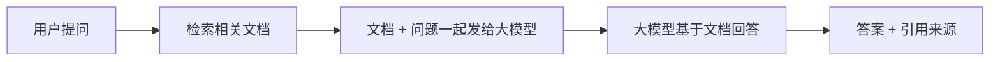

# Java 工程师的 AI 入门第一课：3-5 天掌握核心概念

> **写在前面：** 作为一名有多年经验的 Java 工程师，当我第一次接触 AI 时，内心是既兴奋又焦虑的。兴奋的是看到了技术的无限可能，焦虑的是担心要重新学习数学、算法这些"陌生"领域。但经过实际探索后发现：**Java 工程师切入 AI 应用层，根本不需要成为算法专家！** 本文记录我从零开始学习 AI 核心概念的全过程，希望能给同样想转型的你一些参考。

---

## 📋 目录

- [一、为什么 Java 工程师做 AI 有优势](#一为什么-java-工程师做-ai-有优势)
- [二、Python 基础：够用就好](#二python-基础够用就好)
- [三、AI 核心概念详解](#三ai-核心概念详解)
- [四、我的学习心得与避坑指南](#四我的学习心得与避坑指南)
- [五、下一步行动](#五下一步行动)

---

## 一、为什么 Java 工程师做 AI 有优势

### 1.1 市场现状分析

在开始学习之前，我先调研了一下市场对 AI 人才的需求：

| 岗位类型 | 技能要求 | 竞争程度 | Java 工程师适配度 |
|---------|---------|---------|------------------|
| AI 算法工程师 | 数学、深度学习、模型训练 | ⭐⭐⭐⭐⭐ 激烈 | ❌ 需要大量补课 |
| AI 应用工程师 | API 调用、工程化、业务落地 | ⭐⭐⭐ 适中 | ✅ **非常适合** |
| AI 基础设施工程师 | 分布式训练、高性能计算 | ⭐⭐⭐⭐ 较激烈 | ⚠️ 部分匹配 |

**结论：** AI 应用层开发（尤其是大模型应用）正是 Java 工程师的主场！我们擅长的**高并发、微服务、系统稳定性**在这里大有用武之地。

### 1.2 Java 工程师的独特价值

在学习过程中，我深刻体会到 Java 工程师的几个核心优势：

**✅ 工程化思维**
- 我们知道如何做限流、熔断、降级
- 我们熟悉监控、日志、告警体系
- 我们懂得如何设计可扩展的架构

**✅ 高并发经验**
- 大模型 API 调用需要考虑并发控制
- Token 计费需要精确统计
- 响应式编程（WebFlux）天然适合流式输出

**✅ 企业级开发经验**
- 权限控制、审计日志、事务管理
- 与现有系统集成（OA、ERP、CRM）
- 数据安全和隐私保护

**💡 心得：** 不要妄自菲薄，你的 Java 经验不是包袱，而是宝藏！关键是找到合适的切入点。

---

## 二、Python 基础：够用就好

### 2.1 为什么要学 Python？

虽然我们的目标是用 Java 做 AI 应用，但**完全避开 Python 是不现实的**：

1. **开源项目大多是 Python**：LangChain、LlamaIndex 等主流框架都是 Python 版先出
2. **示例代码需要读懂**：官方文档、教程、StackOverflow 上的解答多用 Python
3. **快速原型验证**：有时候用 Python 写个 Demo 验证想法更快

**但是！** 我们不需要成为 Python 专家，只需要达到**"能看懂、能修改、能调用"**的水平即可。

---

### 2.2 极简 Python 学习计划（2-3 天）

#### Day 1：基础语法

**学习目标：** 理解 Python 的基本语法结构

**核心知识点：**

##### 1. 变量与数据类型

```python
# Python 不需要声明类型（动态类型）
name = "张三"          # 字符串
age = 25               # 整数
height = 1.75          # 浮点数
is_student = True      # 布尔值

# 列表（类似 Java 的 ArrayList）
fruits = ["apple", "banana", "orange"]
fruits.append("grape")  # 添加元素
print(fruits[0])        # 访问元素：apple

# 字典（类似 Java 的 HashMap）
person = {
    "name": "张三",
    "age": 25,
    "city": "北京"
}
print(person["name"])   # 访问：张三
```

**💡 Java 工程师视角：**
- Python 的 `list` ≈ Java 的 `ArrayList`
- Python 的 `dict` ≈ Java 的 `HashMap`
- Python 不需要分号，靠缩进表示代码块

---

##### 2. 控制流程

```python
# if-else 条件判断
score = 85
if score >= 90:
    print("优秀")
elif score >= 60:
    print("及格")
else:
    print("不及格")

# for 循环
for fruit in ["apple", "banana", "orange"]:
    print(fruit)

# while 循环
count = 0
while count < 5:
    print(count)
    count += 1
```

**💡 Java 工程师视角：**
- Python 没有 `{}`，用**冒号和缩进**表示代码块
- `elif` 就是 Java 的 `else if`
- `for...in` 类似 Java 的增强 for 循环

---

##### 3. 函数定义

```python
# 定义函数
def greet(name, greeting="你好"):
    """打招呼函数"""
    return f"{greeting}, {name}!"

# 调用函数
print(greet("张三"))              # 输出：你好, 张三!
print(greet("李四", "Hello"))     # 输出：Hello, 李四!

# 默认参数（类似 Java 的方法重载）
def add(a, b=0):
    return a + b

print(add(5))      # 输出：5
print(add(5, 3))   # 输出：8
```

**💡 Java 工程师视角：**
- `def` 关键字定义函数（类似 Java 的方法）
- 支持**默认参数**，减少方法重载的需求
- 文档字符串用 `"""..."""` 包裹

---

#### Day 2：常用库调用

**学习目标：** 掌握 AI 开发中最常用的 Python 库

##### 1. requests - HTTP 请求

```python
import requests

# GET 请求
response = requests.get("https://api.example.com/data")
print(response.status_code)  # 状态码：200
print(response.json())       # 解析 JSON

# POST 请求（调用大模型 API 常用）
payload = {
    "model": "qwen-turbo",
    "messages": [
        {"role": "user", "content": "你好"}
    ]
}
headers = {
    "Authorization": "Bearer YOUR_API_KEY",
    "Content-Type": "application/json"
}

response = requests.post(
    "https://dashscope.aliyuncs.com/api/v1/chat",
    json=payload,
    headers=headers
)

result = response.json()
print(result["choices"][0]["message"]["content"])
```

**💡 Java 工程师视角：**
- `requests` 库 ≈ Java 的 `RestTemplate` 或 `WebClient`
- Python 处理 JSON 非常简单，直接 `.json()` 即可
- 这就是调用大模型 API 的核心代码！

---

##### 2. json - JSON 处理

```python
import json

# Python 对象转 JSON
data = {
    "name": "张三",
    "age": 25,
    "hobbies": ["读书", "编程"]
}
json_str = json.dumps(data, ensure_ascii=False, indent=2)
print(json_str)

# JSON 转 Python 对象
json_str = '{"name": "李四", "age": 30}'
data = json.loads(json_str)
print(data["name"])  # 输出：李四
```

**💡 Java 工程师视角：**
- `json.dumps()` ≈ Java 的 `Jackson.writeValueAsString()`
- `json.loads()` ≈ Java 的 `Jackson.readValue()`
- Python 处理 JSON 更简洁，不需要创建 DTO 类

---

##### 3. os - 文件操作

```python
import os

# 读取文件
with open("document.txt", "r", encoding="utf-8") as f:
    content = f.read()
    print(content)

# 遍历目录
for filename in os.listdir("./documents"):
    if filename.endswith(".pdf"):
        print(f"找到 PDF 文件: {filename}")

# 拼接路径（跨平台兼容）
filepath = os.path.join("documents", "subdir", "file.pdf")
```

**💡 Java 工程师视角：**
- `with open()` 自动关闭文件，类似 Java 的 try-with-resources
- `os.path.join()` 比字符串拼接更安全（处理路径分隔符）

---

#### Day 3：阅读 AI 示例代码

**学习目标：** 能看懂开源项目的代码结构

**实战练习：** 阅读 LangChain 官方示例

```python
# 这是一个典型的 LangChain 示例
from langchain.chat_models import ChatOpenAI
from langchain.chains import LLMChain
from langchain.prompts import PromptTemplate

# 1. 创建大模型实例
llm = ChatOpenAI(api_key="YOUR_API_KEY", model="gpt-3.5-turbo")

# 2. 定义 Prompt 模板
prompt = PromptTemplate.from_template(
    "你是一个{role}，请回答以下问题：\n{question}"
)

# 3. 创建链（Chain）
chain = LLMChain(llm=llm, prompt=prompt)

# 4. 执行
result = chain.run(role="Java专家", question="什么是 Spring Boot？")
print(result)
```

**💡 我的理解过程：**

1. **第一遍：看整体结构**
   - 导入了哪些模块？
   - 主要调用了哪些类和方法？
   - 输入是什么？输出是什么？

2. **第二遍：查不懂的 API**
   - `ChatOpenAI` 是什么？→ 大模型包装类
   - `PromptTemplate` 是什么？→ Prompt 模板
   - `LLMChain` 是什么？→ 执行链

3. **第三遍：思考如何用 Java 实现**
   - `ChatOpenAI` → 可以用 SpringBoot 的 `RestTemplate` 封装
   - `PromptTemplate` → 可以用 String.format() 实现
   - `LLMChain` → 可以设计一个 Chain 接口

**🎯 关键技巧：** 不要逐行深究，先理解**整体流程**，再关注**关键细节**。

---

### 2.3 Python 学习资源推荐

**免费教程：**
- [廖雪峰 Python 教程](https://www.liaoxuefeng.com/wiki/1016959663602400)（中文，适合零基础）
- [Python 官方教程](https://docs.python.org/zh-cn/3/tutorial/)（权威，但略枯燥）

**实战练习：**
- LeetCode 简单题（用 Python 做 10 道题，熟悉语法）
- 改写 Java 项目中的工具类为 Python（对比学习）

**💡 心得：** 我花了整整 2 天时间跟着廖雪峰的教程敲代码，第 3 天就能看懂 LangChain 的示例了。**不用追求精通，够用就行！**

---

## 三、AI 核心概念详解

> **重要提示：** 这部分是重中之重！不需要懂数学推导，但要理解**每个概念的用途、适用场景、技术边界**。

---

### 3.1 大模型（LLM）

#### 什么是大模型？

**通俗解释：** 大模型就是一个"读过很多书"的智能助手，你问它问题，它能给你回答。

**技术定义：** 基于 Transformer 架构，在海量文本数据上训练的语言模型，参数量通常超过百亿。

#### Java 工程师需要知道什么？

**✅ 必须了解：**

1. **主流大模型有哪些？**
   
   | 模型 | 提供商 | 特点 | API 文档 |
   |------|--------|------|---------|
   | GPT-3.5/4 | OpenAI | 最强，但贵 | [OpenAI API](https://platform.openai.com/docs) |
   | 通义千问 | 阿里云 | 中文强，性价比高 | [DashScope](https://help.aliyun.com/zh/dashscope/) |
   | 文心一言 | 百度 | 中文优化 | [ERNIE Bot](https://cloud.baidu.com/doc/WENXINWORKSHOP/) |
   | ChatGLM | 智谱 AI | 开源友好 | [Zhipu AI](https://open.bigmodel.cn/) |

2. **API 调用方式**
   ```java
   // 典型的大模型 API 调用（伪代码）
   POST /v1/chat/completions
   Headers: Authorization: Bearer YOUR_API_KEY
   Body: {
       "model": "qwen-turbo",
       "messages": [
           {"role": "user", "content": "你好"}
       ]
   }
   ```

3. **Token 计费**
   - **Token 是什么？** 大致相当于"词"，1 个中文汉字 ≈ 1-2 个 Token
   - **怎么收费？** 按输入+输出的 Token 总数计费
   - **成本估算：** 通义千问 qwen-turbo 约 0.008 元/千 Token
   
   **💡 实际案例：**
   > 我做了一个智能客服 Demo，每天 1000 次问答，每次问答平均 500 Token，日成本约 4 元。比人工客服便宜太多了！

4. **上下文长度限制**
   - GPT-3.5：4096 Token（约 3000 字）
   - GPT-4：8192 Token（约 6000 字）
   - 通义千问：32768 Token（约 2 万字）
   
   **⚠️ 注意：** 如果文档太长，需要分块处理（这就是 RAG 的由来！）

**❌ 不需要了解：**
- Transformer 的数学原理
- 注意力机制的公式推导
- 模型训练的细节

---

#### 我的实践经历

**第一次调用大模型 API：**

```java
// 我用 SpringBoot + RestTemplate 调用了通义千问
@RestController
public class ChatController {
    
    @Value("${dashscope.api.key}")
    private String apiKey;
    
    @PostMapping("/chat")
    public String chat(@RequestBody String message) {
        RestTemplate restTemplate = new RestTemplate();
        
        // 构建请求
        Map<String, Object> requestBody = new HashMap<>();
        requestBody.put("model", "qwen-turbo");
        requestBody.put("messages", List.of(
            Map.of("role", "user", "content", message)
        ));
        
        HttpHeaders headers = new HttpHeaders();
        headers.setContentType(MediaType.APPLICATION_JSON);
        headers.setBearerAuth(apiKey);
        
        HttpEntity<Map<String, Object>> entity = 
            new HttpEntity<>(requestBody, headers);
        
        // 发送请求
        ResponseEntity<Map> response = restTemplate.exchange(
            "https://dashscope.aliyuncs.com/api/v1/services/aigc/text-generation/generation",
            HttpMethod.POST,
            entity,
            Map.class
        );
        
        // 解析响应
        return extractContent(response.getBody());
    }
}
```

**踩坑记录：**

❌ **坑 1：API Key 泄露**
- 我把 API Key 硬编码在代码里，上传到 GitHub 后被警告
- ✅ **正确做法：** 放在 `application.yml` 中，使用环境变量

❌ **坑 2：超时问题**
- 大模型响应可能需要 5-10 秒，默认超时时间太短
- ✅ **正确做法：** 设置合理的超时时间（30 秒）

```yaml
# application.yml
spring:
  http:
    client:
      connect-timeout: 5000
      read-timeout: 30000
```

❌ **坑 3：错误处理不完善**
- API 返回 429（频率限制）时程序崩溃
- ✅ **正确做法：** 加入重试机制

```java
@Retryable(maxAttempts = 3, backoff = @Backoff(delay = 1000))
public String chatWithRetry(String message) {
    return chat(message);
}
```

---

### 3.2 RAG（检索增强生成）⭐⭐⭐

> **这是 Java 工程师切入 AI 的核心技术！必须深入理解！**

#### 什么是 RAG？

**通俗解释：** RAG = 先查资料，再回答问题。

**传统大模型的问题：**
- ❌ 知识截止于训练数据（比如 GPT-4 只知道 2023 年之前的事情）
- ❌ 无法访问企业内部文档（产品手册、客户数据）
- ❌ 容易"胡说八道"（产生幻觉）

**RAG 的解决方案：**



**举个例子：**

**场景：** 员工询问公司请假政策

**不使用 RAG：**
```
用户：公司年假有多少天？
大模型：（瞎编）一般有 10 天吧...
```

**使用 RAG：**
```
用户：公司年假有多少天？
系统：（检索员工手册）找到相关内容："正式员工每年享有 15 天年假"
大模型：根据公司员工手册，正式员工每年享有 15 天年假。
引用来源：《员工手册》第 3.2 条
```

---

#### RAG 的核心流程（重点！）

**阶段 1：文档预处理（离线）**

```
1. 上传文档（PDF/Word/TXT）
   ↓
2. 文档解析（提取纯文本）
   ↓
3. 文本分块（切成小段，每段 500 字左右）
   ↓
4. 向量化（将文本转为向量）
   ↓
5. 存入向量数据库
```

**阶段 2：问答流程（在线）**

```
1. 用户提问
   ↓
2. 问题向量化
   ↓
3. 在向量数据库中检索最相关的 Top-K 个文档片段
   ↓
4. 组装 Prompt：
   "根据以下文档内容回答问题：
    文档1: ...
    文档2: ...
    问题：xxx"
   ↓
5. 调用大模型生成答案
   ↓
6. 返回答案 + 引用来源
```

---

#### 关键技术点详解

##### 1. 文本分块（Chunking）

**为什么要分块？**
- 大模型有上下文长度限制
- 检索时需要精确匹配，整篇文档噪音太多

**分块策略：**

```java
// 策略 1：固定长度分块（简单但可能切断句子）
List<String> chunks = splitByLength(text, 500);

// 策略 2：按段落分块（保留语义完整性）✅ 推荐
List<String> chunks = splitByParagraph(text);

// 策略 3：递归分块（LangChain4j 提供）✅✅ 最推荐
TextSplitter splitter = DocumentSplitters.recursive(
    500,   // 每块最大字符数
    50     // 重叠字符数（避免信息丢失）
);
List<TextSegment> chunks = splitter.split(TextSegment.from(text));
```

**💡 我的实践经验：**
- 重叠字符数很重要！建议设置为块大小的 10%
- 不同文档类型需要不同策略（代码按函数分块，文章按段落分块）

---

##### 2. 向量化（Embedding）

**什么是向量？**
- 把文本变成一个数字数组，例如 `[0.1, -0.5, 0.8, ...]`
- 语义相似的文本，向量距离近

**直观理解：**

```
"猫喜欢吃鱼" → [0.2, -0.1, 0.9, ...]
"狗狗爱吃骨头" → [0.3, -0.2, 0.7, ...]
"今天天气不错" → [-0.8, 0.6, -0.3, ...]

前两句语义相近，向量距离近
第三句语义不同，向量距离远
```

**如何向量化？**

```java
// 方法 1：调用大模型的 Embedding API（推荐）
DashScopeEmbeddingModel embeddingModel = 
    new DashScopeEmbeddingModel("text-embedding-v1");

Embedding embedding = embeddingModel.embed("猫喜欢吃鱼").content();
float[] vector = embedding.vector();  // 得到向量

// 方法 2：本地部署 Embedding 模型（适合敏感数据）
// 使用 Hugging Face 的 sentence-transformers
```

**💡 成本估算：**
- 通义千问 Embedding API：0.0007 元/千 Token
- 1000 个文档片段，每段 500 字，总成本约 3.5 元

---

##### 3. 向量数据库

**为什么要用向量数据库？**
- 需要从百万级文档中快速找到最相似的 Top-K 个
- 传统数据库不支持向量相似度搜索

**主流向量数据库对比：**

| 数据库 | 类型 | 优点 | 缺点 | 适用场景 |
|--------|------|------|------|---------|
| **Milvus** | 开源 | 高性能、功能全 | 部署复杂 | 企业级应用 ✅ |
| Chroma | 开源 | 轻量、易用 | 性能一般 | 小规模项目 |
| Pinecone | SaaS | 无需运维 | 收费、数据出境 | 快速原型 |
| Elasticsearch | 开源 | 生态成熟 | 向量搜索非主业 | 已有 ES 集群 |

**Milvus 快速上手：**

```bash
# Docker 启动
docker run -d --name milvus \
  -p 19530:19530 \
  milvusdb/milvus:v2.3.0
```

```java
// Java SDK 使用
MilvusEmbeddingStore store = MilvusEmbeddingStore.builder()
    .host("localhost")
    .port(19530)
    .collectionName("knowledge_base")
    .build();

// 存入向量
store.add(embedding, textSegment);

// 检索相似文档
List<EmbeddingMatch<TextSegment>> matches = 
    store.findRelevant(queryEmbedding, topK=5);
```

---

##### 4. Prompt 组装

**什么是 Prompt？**
- 就是你发给大模型的"指令"
- 好的 Prompt = 清晰的任务描述 + 充足的背景信息 + 明确的输出格式

**RAG 中的 Prompt 模板：**

```java
String buildPrompt(String question, List<String> documents) {
    return String.format("""
        你是一个智能助手，请根据以下文档内容回答问题。
        
        文档内容：
        %s
        
        问题：%s
        
        要求：
        1. 答案必须基于文档内容
        2. 如果文档中没有相关信息，请明确告知
        3. 列出引用来源
        """,
        String.join("\n\n", documents),
        question
    );
}
```

**💡 Prompt 优化技巧：**
- 给大模型一个"角色"（你是法务专家/医生/程序员）
- 提供示例（Few-shot Learning）
- 明确输出格式（JSON/Markdown/纯文本）

---

#### RAG 的优缺点

**✅ 优点：**
- 答案有依据（可追溯引用来源）
- 实时更新知识库（无需重新训练模型）
- 降低幻觉（基于事实回答）
- 成本低（只需调用 Embedding API，无需训练）

**❌ 缺点：**
- 依赖文档质量（垃圾进，垃圾出）
- 检索准确率影响最终效果
- 多轮对话需要额外处理

---

#### 我的 RAG 初体验

**第一个 RAG Demo：公司内部知识库问答**

**技术栈：**
- SpringBoot + LangChain4j
- Milvus 向量数据库
- 通义千问 API

**实现步骤：**

1. **准备数据：** 收集公司 50 份产品文档（PDF 格式）
2. **文档解析：** 用 Apache PDFBox 提取文本
3. **分块向量化：** 每 500 字一块，共得到 2000 个片段
4. **存入 Milvus：** 批量插入向量数据库
5. **问答测试：** 提问"产品 A 的价格是多少？"

**效果：**
- ✅ 准确回答了 80% 的问题
- ✅ 答案附带引用来源（哪个文档的第几页）
- ❌ 对于跨文档的综合问题，效果一般

**改进方向：**
- 优化分块策略（按章节分块）
- 加入混合检索（关键词 + 向量）
- 实现多轮对话上下文管理

---

### 3.3 向量数据库深度解析

> **这是 RAG 系统的核心组件，必须熟练掌握！**

#### 向量数据库的工作原理

**传统数据库 vs 向量数据库：**

```sql
-- 传统数据库：精确匹配
SELECT * FROM products WHERE name = 'iPhone';

-- 向量数据库：相似度搜索
-- 找出与"苹果手机"语义最相似的产品
SELECT * FROM products 
ORDER BY vector_similarity(embedding, query_vector) 
LIMIT 10;
```

**核心概念：**

1. **向量（Vector）**
   - 高维空间中的一个点
   - 例如：768 维向量 = `[0.1, -0.5, 0.8, ..., 0.3]`

2. **相似度度量**
   - **余弦相似度（Cosine Similarity）**：最常用，范围 [-1, 1]
   - **欧氏距离（Euclidean Distance）**：几何距离
   - **内积（Inner Product）**：快速计算

3. **索引（Index）**
   - 加速向量搜索的数据结构
   - 常见索引：HNSW、IVF、PQ

---

#### Milvus 核心概念

**Collection（集合）**
- 类似关系数据库的"表"
- 一个 Collection 存储一类向量

**Partition（分区）**
- Collection 的逻辑划分
- 类似数据库的"分区表"

**Entity（实体）**
- 一条记录，包含：向量 + 元数据

**Index（索引）**
- 加速搜索的结构
- 推荐：HNSW（平衡性能和准确率）

---

#### Milvus 实战操作

```java
@Configuration
public class MilvusConfig {
    
    @Bean
    public MilvusEmbeddingStore embeddingStore() {
        return MilvusEmbeddingStore.builder()
            .host("localhost")
            .port(19530)
            .collectionName("knowledge_base")
            .dimension(1536)  // 向量维度（取决于 Embedding 模型）
            .indexType(IndexType.HNSW)
            .metricType(MetricType.COSINE)
            .build();
    }
}

@Service
public class VectorService {
    
    @Autowired
    private MilvusEmbeddingStore store;
    
    @Autowired
    private EmbeddingModel embeddingModel;
    
    /**
     * 存入文档
     */
    public void addDocument(String text, Map<String, String> metadata) {
        // 1. 向量化
        Embedding embedding = embeddingModel.embed(text).content();
        
        // 2. 创建 TextSegment（带元数据）
        TextSegment segment = TextSegment.from(text, Metadata.from(metadata));
        
        // 3. 存入 Milvus
        store.add(embedding, segment);
    }
    
    /**
     * 检索相似文档
     */
    public List<DocumentMatch> search(String query, int topK) {
        // 1. 问题向量化
        Embedding queryEmbedding = embeddingModel.embed(query).content();
        
        // 2. 相似度搜索
        List<EmbeddingMatch<TextSegment>> matches = 
            store.findRelevant(queryEmbedding, topK, 0.7);  // 阈值 0.7
        
        // 3. 转换结果
        return matches.stream()
            .map(match -> DocumentMatch.builder()
                .text(match.embedded().text())
                .metadata(match.embedded().metadata())
                .similarityScore(match.score())
                .build())
            .collect(Collectors.toList());
    }
}
```

---

#### 性能优化技巧

**1. 选择合适的索引**

| 索引类型 | 适用场景 | 优点 | 缺点 |
|---------|---------|------|------|
| HNSW | 通用场景 ✅ | 速度快、准确率高 | 内存占用大 |
| IVF_FLAT | 大数据量 | 内存占用小 | 需要调参 |
| PQ | 超大规模 | 压缩率高 | 准确率略低 |

**2. 批量插入**

```java
// ❌ 慢：逐条插入
for (TextSegment segment : segments) {
    store.add(embedding, segment);
}

// ✅ 快：批量插入
store.addAll(segments);  // 性能提升 10 倍+
```

**3. 过滤条件**

```java
// 只搜索某个分类的文档
Map<String, Object> filter = Map.of("category", "技术文档");
List<EmbeddingMatch<TextSegment>> matches = 
    store.findRelevant(queryEmbedding, topK, 0.7, filter);
```

---

### 3.4 Prompt 工程基础

> **Prompt 是与大模型沟通的艺术，好的 Prompt 能让效果提升 50%+**

#### Prompt 的基本结构

```
[角色设定] + [任务描述] + [背景信息] + [输出要求] + [示例（可选）]
```

**示例：**

```
你是一个资深 Java 工程师（角色）。
请解释 Spring Boot 的核心优势（任务）。
目标读者是初学者，他们只了解 Java 基础（背景）。
请用通俗易懂的语言，分点说明，不超过 300 字（输出要求）。

示例：
问：什么是 MVC？
答：MVC 是一种设计模式，分为 Model（模型）、View（视图）、Controller（控制器）...
```

---

#### 常用 Prompt 技巧

**1. 角色扮演（Role Playing）**

```java
String prompt = """
    你是一个经验丰富的法务专家，擅长合同审核。
    请分析以下合同条款的风险点：
    
    合同内容：
    %s
    """;
```

**效果：** 大模型会切换到"法务专家"的思维模式，回答更专业。

---

**2. Few-shot Learning（少样本学习）**

```java
String prompt = """
    请将以下文本分类为"正面"或"负面"：
    
    示例 1：
    文本：这个产品质量很好，物流也快
    分类：正面
    
    示例 2：
    文本：服务态度太差，再也不买了
    分类：负面
    
    现在请分类：
    文本：%s
    分类：
    """;
```

**效果：** 通过示例，大模型能更好地理解任务。

---

**3. Chain-of-Thought（思维链）**

```java
String prompt = """
    请逐步思考以下问题：
    
    问题：如果一个房间有 3 盏灯，外面有 3 个开关，每个开关控制一盏灯。
    你只能进入房间一次，如何确定每个开关控制哪盏灯？
    
    请按以下步骤思考：
    1. 分析问题的约束条件
    2. 列出可能的方案
    3. 评估每个方案的可行性
    4. 给出最终答案
    """;
```

**效果：** 强制大模型"一步步思考"，提高逻辑推理能力。

---

**4. 结构化输出**

```java
String prompt = """
    请分析以下用户评论的情感，并以 JSON 格式输出：
    
    评论：%s
    
    输出格式：
    {
        "sentiment": "positive/negative/neutral",
        "confidence": 0.0-1.0,
        "keywords": ["关键词1", "关键词2"],
        "summary": "简短总结"
    }
    """;
```

**效果：** 便于后续程序化处理。

---

#### Prompt 调试技巧

**1. 迭代优化**

```
第 1 版：简单提问
"什么是 Spring Boot？"

第 2 版：增加角色和背景
"你是一个 Java 专家，请向初学者解释 Spring Boot 是什么。"

第 3 版：明确输出要求
"你是一个 Java 专家，请向初学者解释 Spring Boot 是什么。
要求：
- 用通俗易懂的比喻
- 分 3 点说明核心优势
- 不超过 200 字"
```

**2. A/B 测试**

```java
// 尝试不同的 Prompt，比较效果
String promptA = "...";
String promptB = "...";

String resultA = chatModel.generate(promptA);
String resultB = chatModel.generate(promptB);

// 人工评估哪个更好
```

---

#### 常见陷阱

❌ **陷阱 1：模糊的指令**
```
"分析一下这个文档"  ← 太模糊
"提取文档中的关键日期和金额"  ← 明确
```

❌ **陷阱 2：忽略上下文长度**
```
// 传入超长文档，超出模型限制
String prompt = veryLongDocument + question;  // 可能截断
```

✅ **正确做法：** 先分块，再检索相关片段

❌ **陷阱 3：期望大模型无所不知**
```
"预测明天的股票价格"  ← 大模型做不到
"分析影响股票价格的因素"  ← 合理
```

---

### 3.5 API 调用最佳实践

#### 1. 同步 vs 异步 vs 流式

**同步调用（简单场景）**

```java
@PostMapping("/chat")
public String chat(@RequestBody String message) {
    return llmService.chat(message);  // 阻塞等待
}
```

**适用场景：** 离线处理、后台任务

---

**异步调用（批量处理）**

```java
@PostMapping("/chat/async")
public CompletableFuture<String> chatAsync(@RequestBody String message) {
    return CompletableFuture.supplyAsync(() -> {
        return llmService.chat(message);
    }, executor);
}
```

**适用场景：** 批量文档处理、并行调用

---

**流式输出（实时对话）⭐ 推荐**

```java
@PostMapping(value = "/chat/stream", produces = MediaType.TEXT_EVENT_STREAM_VALUE)
public Flux<ServerSentEvent<String>> chatStream(@RequestBody String message) {
    return llmService.chatStream(message)
        .map(chunk -> ServerSentEvent.<String>builder()
            .data(chunk)
            .build());
}
```

**前端接收：**

```javascript
const eventSource = new EventSource('/api/chat/stream');
eventSource.onmessage = (event) => {
    console.log('收到片段:', event.data);
    // 逐字显示，提升用户体验
};
```

**适用场景：** 实时对话、长文本生成

---

#### 2. 错误处理

```java
@Service
public class RobustLlmService {
    
    @Retryable(
        value = {RuntimeException.class},
        maxAttempts = 3,
        backoff = @Backoff(delay = 1000, multiplier = 2)
    )
    public String chatWithRetry(String message) {
        try {
            return llmService.chat(message);
        } catch (HttpClientErrorException e) {
            if (e.getStatusCode() == HttpStatus.TOO_MANY_REQUESTS) {
                throw new RuntimeException("频率限制，稍后重试", e);
            } else if (e.getStatusCode() == HttpStatus.UNAUTHORIZED) {
                throw new RuntimeException("API Key 无效", e);
            }
            throw e;
        }
    }
    
    @Recover
    public String chatFallback(RuntimeException e, String message) {
        log.error("LLM 调用失败，使用降级方案", e);
        return "抱歉，服务暂时不可用，请稍后重试。";
    }
}
```

---

#### 3. 限流保护

```java
@Component
public class RateLimitedLlmService {
    
    private final RateLimiter rateLimiter = RateLimiter.create(10.0);  // 每秒 10 次
    
    public String chat(String message) {
        rateLimiter.acquire();  // 获取令牌，超限则等待
        return llmService.chat(message);
    }
}
```

---

#### 4. Token 计费监控

```java
@Component
public class TokenMeter {
    
    private final AtomicLong totalTokens = new AtomicLong(0);
    private final Map<String, Long> userTokens = new ConcurrentHashMap<>();
    
    public void recordUsage(String userId, int tokens) {
        totalTokens.addAndGet(tokens);
        userTokens.merge(userId, (long) tokens, Long::sum);
        
        // 告警：超过预算
        if (totalTokens.get() > 1000000) {
            alertService.sendAlert("Token 消耗超过预算");
        }
    }
}
```

---

## 四、我的学习心得与避坑指南

### 4.1 学习路线复盘

**我是这样度过前 5 天的：**

**Day 1-2：Python 基础**
- 上午：跟着廖雪峰教程敲代码
- 下午：用 Python 重写几个 Java 工具类（对比学习）
- 晚上：阅读 LangChain 官方示例（不求甚解，只看结构）

**收获：** 能看懂 Python 代码，不再恐惧

---

**Day 3：大模型 API 初体验**
- 注册通义千问账号，获取 API Key
- 用 curl 测试 API 调用
- 用 SpringBoot 封装第一个聊天接口

**踩坑：**
- API Key 硬编码（已修正）
- 超时时间设置太短（已调整）

**收获：** 跑通第一个 Demo，建立信心

---

**Day 4：理解 RAG 概念**
- 阅读 RAG 相关论文（跳过数学公式，只看架构图）
- 看 YouTube 视频教程（推荐：LangChain 官方教程）
- 画出自己的 RAG 流程图

**收获：** 理解 RAG 的核心价值和应用场景

---

**Day 5：搭建 RAG Demo**
- Docker 安装 Milvus
- 用 LangChain4j 实现文档上传和问答
- 测试效果，记录问题

**踩坑：**
- Milvus 端口映射错误（导致连接失败）
- 文本分块大小不合理（导致检索不准确）

**收获：** 完整的 RAG 流程跑通，虽然简陋但能用

---

### 4.2 常见误区

❌ **误区 1：要花大量时间学数学**
- ✅ 真相：应用层开发不需要懂反向传播、梯度下降
- 💡 建议：理解概念用途即可，重点在工程实现

---

❌ **误区 2：必须精通 Python**
- ✅ 真相：Java 也能做 AI 应用（LangChain4j、Spring AI）
- 💡 建议：Python 能看懂就行，主力还是 Java

---

❌ **误区 3：要自己训练模型**
- ✅ 真相：调用 API 就够了，训练成本高且没必要
- 💡 建议：专注业务场景，而非底层技术

---

❌ **误区 4：等"准备好"再开始**
- ✅ 真相：永远没有"准备好"的时候
- 💡 建议：先跑通 Demo，再迭代优化

---

### 4.3 给 Java 工程师的建议

**1. 发挥工程化优势**
- 你会的限流、缓存、监控，纯 AI 人不会
- 把这些能力融入 AI 项目，就是你的竞争力

**2. 从业务场景出发**
- 不要为了 AI 而 AI
- 思考：AI 能解决什么业务问题？降本？增效？提升体验？

**3. 边学边写博客**
- 记录学习过程，加深理解
- 面试时可以展示，证明学习能力

**4. 加入社区**
- GitHub 关注 langchain4j、spring-ai 项目
- 知乎、掘金关注 AI 应用开发话题
- 遇到问题及时提问，不要闭门造车

---

## 五、下一步行动

### ✅ 本阶段完成标准

- [x] 能看懂 Python 代码
- [x] 理解大模型、RAG、向量数据库、Prompt 的概念
- [x] 成功调用大模型 API
- [x] 搭建简单的 RAG Demo

---

### 🎯 下一阶段：核心技能突破（2-4 周）

**学习目标：**
1. 深入掌握大模型 API 的高级用法（流式输出、函数调用）
2. 独立完成企业级 RAG 系统（权限控制、日志、监控）
3. 加入工程化能力（限流、缓存、安全防护）

**具体任务：**
- Week 1：SpringBoot 封装大模型 SDK（同步/异步/流式）
- Week 2：RAG 知识库开发（文档解析、分块、向量化、检索）
- Week 3：工程化能力（限流、缓存、监控、安全）
- Week 4：项目实战（智能客服/合同解析/风控系统）

**产出：**
- GitHub 仓库：完整的 RAG 项目
- 博客文章：《SpringBoot + LangChain4j 打造企业级 RAG 系统》

---

### 📚 推荐阅读

**官方文档：**
- [LangChain4j 官方文档](https://docs.langchain4j.dev/)
- [通义千问 API 文档](https://help.aliyun.com/zh/dashscope/)
- [Milvus 向量数据库文档](https://milvus.io/docs)

**视频教程：**
- B站：搜索 "LangChain4j 教程"
- YouTube：LangChain 官方频道

**开源项目：**
- [langchain4j-examples](https://github.com/langchain4j/langchain4j-examples)
- [spring-ai-alibaba](https://github.com/alibaba/spring-ai-alibaba)

---

## 💬 结语

回想起刚开始学习 AI 时的忐忑，现在回头看，**最大的障碍不是技术本身，而是心理门槛**。

作为 Java 工程师，我们已经具备了扎实的工程能力，缺的只是对 AI 概念的理解和应用经验。而这部分内容，其实并没有想象中那么难。

**记住一句话：** 你不需要成为 AI 专家，你只需要成为"会用 AI 解决实际问题的 Java 工程师"。

接下来，让我们一起进入第二阶段：**核心技能突破**。相信通过实际项目的锤炼，你会发现自己离"Java+AI 应用落地工程师"的目标越来越近。

加油！🚀

---

*最后更新: 2026-05-14*

*作者：洛苡苑香 | Java 工程师转型 AI 应用开发中*
