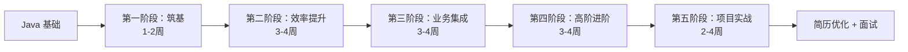

# 后端开发者 AI 实战完整学习指南

> **更新时间：** 2026-05-17  
> **适用人群：** 后端开发工程师、服务端研发、Java/Go/Python 后端从业者、意向转型大模型后端方向研发人员  
> **学习体系：** 10~12 周系统化学习，由浅入深递进学习  
> **整体理念：** 循序渐进（工具使用 → 原理认知 → 自主开发 → 项目落地）| 实战优先 | 后端适配 | 职业导向

---

## 📋 前言

作为一名 Java 工程师，如何在不转算法、不重学底层的前提下快速切入 AI 领域并拿到 offer？

**答案：做 Java+AI 应用落地工程师，主打工程化与业务价值。**

本文档记录我从传统 Java 开发转向 AI 应用开发的完整学习路径，包括技术选型、项目实战和面试准备。目标是成为**懂业务、懂框架、能落地的稀缺人才**。

### 核心定位

- ❌ 不做纯 Java CRUD 工程师
- ❌ 不做纯 AI 算法研究员
- ✅ **做 Java + AI 工程化落地专家**

### 学习路线图总览



**学习理念：**
- **循序渐进：** 工具使用 → 原理认知 → 自主开发 → 项目落地
- **实战优先：** 贴合后端业务、服务开发、接口开发、线上部署真实场景
- **后端适配：** 全程以服务端研发视角讲解，剔除无关内容
- **职业导向：** 打通传统后端 → AI 赋能后端 → 大模型服务端开发完整成长路径

---

## 🎯 一、三大方向选择（三选一）

### 1. AI 应用开发工程师 ⭐⭐⭐（首选）

**工作内容：**
- 使用 Java 对接大模型 API（通义千问、文心一言、ChatGLM 等）
- 构建 RAG（检索增强生成）系统
- 实现智能问答、文档解析、知识库检索
- AI 功能的工程化落地（限流、缓存、监控）

**技术栈：**
- SpringBoot + LangChain4j / Spring AI
- 向量数据库（Milvus / Chroma / Elasticsearch）
- 大模型 API SDK
- Redis、Sentinel、Prometheus 等工程化工具

**优势：**
- 市场需求最大，岗位最多
- Java 工程化优势明显
- 容易出成果，适合写进简历
- 薪资溢价高（25k-40k/月）

**典型岗位：**
- AI 应用开发工程师
- Java+AI 全栈工程师
- 智能客服系统开发工程师

---

### 2. 现有业务 AI 改造专家 ⭐⭐

**工作内容：**
- 给现有 Java 系统增加 AI 能力
- 智能客服、风控审核、文档解析、日志智能分析
- 不换赛道，直接增值

**典型场景：**
- 电商系统：智能推荐、商品描述生成
- 金融系统：风险评估、合同审核
- OA 系统：智能审批、会议纪要生成
- 日志系统：异常检测、根因分析

**优势：**
- 复用现有业务知识
- 降低转型风险
- 直接提升业务价值
- 内部晋升机会多

---

### 3. AI 基础设施工程师 ⭐

**工作内容：**
- AI 服务平台搭建（模型路由、负载均衡）
- 向量数据库运维与优化
- AI 应用监控与告警体系
- Token 成本管理与优化

**技术栈：**
- Kubernetes + Docker
- Milvus / Elasticsearch 集群
- Prometheus + Grafana
- API Gateway（Kong / APISIX）

**优势：**
- 技术壁垒高
- 可迁移性强
- 适合有 DevOps 经验的工程师

---

### ❌ 不推荐方向

- **纯算法工程师：** 需要大量数学基础，与 Java 割裂，学历要求高
- **只调 API 无工程化：** 缺乏竞争力，容易被替代
- **前端 AI 应用：** 与后端技能重叠度低，需重新学习前端

---

## 📚 二、第一阶段：筑基阶段（1-2 周）

### 第 1 章 主流 AI 大模型工具极速上手实战

**学习目标：**
- 熟练掌握 ChatGPT、Claude、DeepSeek、通义千问等主流大模型日常使用
- 掌握后端研发专属提问逻辑与高效提示词编写思路
- 实现编码排错、文档撰写、业务梳理全流程 AI 提效

**核心学习内容：**

1. **人工智能发展历程与行业技术演进脉络**
   - 了解 AI 发展历史，建立技术认知框架

2. **主流大模型生态梳理**
   - OpenAI 全系模型生态（GPT-3.5/4/4o）
   - Anthropic Claude 模型（长文本、代码场景优势）
   - 国内大模型：通义千问、文心一言、ChatGLM、DeepSeek
   - 区分模型能力差异与后端适配场景

3. **安全使用规范**
   - 账号环境配置
   - 业务代码隐私防护方案
   - API Key 安全管理

4. **通用基础提示词编写逻辑**
   - 结构化提问思维搭建
   - 后端开发通用万能提示词模板

**后端实战应用场景：**
- ✅ 快速生成后端接口骨架代码
- ✅ 复杂业务逻辑梳理与流程拆解
- ✅ 线上报错日志分析、异常堆栈精准定位
- ✅ 技术方案初稿、接口设计文档快速撰写
- ✅ 数据库表结构、字段、索引、注释自动生成
- ✅ 存量代码重构、代码规范统一、冗余逻辑精简

**实践任务：**
1. 使用三款大模型完成后端通用开发任务并做效果对比
2. 搭建个人后端开发高频提示词库
3. 梳理日常工作可被 AI 替代的重复性开发工作清单

---

### 第 2 章 结构化提示词工程深度进阶（后端专用）

**学习目标：**
- 摒弃低效闲聊式提问，掌握工程化专业提问方式
- 精通角色设定、格式约束、输出规范、业务场景限定等高阶用法
- 让大模型严格遵循后端开发规范输出代码、文档、技术方案

**核心学习内容：**

1. **提示词四大核心要素**
   - 角色（Role）
   - 任务（Task）
   - 输出格式（Format）
   - 业务约束（Constraint）

2. **后端工程师专属角色设定话术体系**
   ```
   你是一位资深 Java 后端工程师，精通 SpringBoot、微服务架构、
   数据库优化。请按照阿里巴巴 Java 开发手册规范，帮我...
   ```

3. **代码类提示词精准写法**
   - 指定编程语言：Java 17
   - 技术框架：SpringBoot 3.2 + MyBatis-Plus
   - 设计模式：策略模式、工厂模式
   - 代码规范：阿里巴巴 Java 开发手册

4. **文档类提示词**
   - 接口文档生成规范
   - 库表设计文档
   - 运维文档、部署文档

5. **多轮对话上下文管理**
   - 复杂后端需求拆分提问思路
   - 保持对话连贯性

**后端落地场景：**
- 指定 SpringBoot/SpringCloud 框架生成标准业务代码
- 按照企业内部编码规范统一代码风格与目录结构
- 自动生成单元测试、集成测试可执行测试用例
- 复杂联表 SQL、事务 SQL、性能优化 SQL 智能编写
- 分布式业务流程、微服务调用链路梳理

---

### 第 3 章 大模型基础原理通俗精讲（后端必懂）

**学习目标：**
- 脱离复杂学术公式，以后端开发视角读懂大模型底层运行逻辑
- 理解大模型输入输出、推理执行、上下文限制核心原理
- 明确大模型幻觉问题、代码生成出错的根本原因

**核心学习内容：**

1. **自然语言处理技术发展脉络**
   - 从 RNN 到 Transformer 的演进

2. **Transformer 架构通俗解析**
   - 弱化数学公式，侧重工程理解
   - Attention 机制的核心思想

3. **核心概念详解**
   - **词嵌入（Embedding）：** 文本如何变成向量
   - **上下文窗口（Context Window）：** 为什么有长度限制
   - **Token：** 计费单位与文本长度的关系

4. **大模型三大核心阶段**
   - 预训练（Pre-training）
   - 微调（Fine-tuning）
   - 在线推理（Inference）

5. **对话记忆机制**
   - 上下文如何保持
   - 为什么会遗忘

6. **开源 vs 闭源大模型**
   - 核心差异对比
   - 适用场景分析

7. **算力与性能**
   - 显存占用对部署的影响
   - 推理速度与并发能力
   - 后端部署必备知识

**工程实用价值：**
- ✅ 合理预判 AI 代码产出质量，理性使用 AI 辅助开发
- ✅ 掌握上下文限制规则，完成超长业务代码拆分提问
- ✅ 理解推理耗时逻辑，为自建大模型后端服务打下理论基础
- ✅ 清晰界定大模型能力边界，明确不可依赖 AI 的工作场景

---

## 🚀 三、第二阶段：效率提升核心阶段（3-4 周）

### 第 4 章 AI 辅助后端编码全流程实战

**学习目标：**
- 实现从业务需求到可运行后端代码全流程 AI 辅助开发
- 缩减接口开发、功能迭代、老旧项目维护研发耗时
- 掌握批量代码生成、批量业务逻辑重构高效技巧

**核心学习内容：**

1. **业务需求文档快速拆解**
   - 将需求转化为后端开发任务清单
   - 识别关键技术点与难点

2. **数据库结构设计**
   - AI 一键生成数据表
   - 索引设计建议
   - 字段约束自动生成

3. **持久层代码快速生成**
   - MyBatis/MyBatis-Plus 实体类
   - Mapper 接口与 XML
   - JPA Repository

4. **业务层 Service 分层逻辑**
   - Service 接口与实现类
   - 事务管理注解
   - 业务逻辑梳理

5. **控制层 Controller 接口开发**
   - RESTful API 设计
   - 请求参数封装
   - 统一响应体封装

6. **全局配置类快速生成**
   - 全局异常捕获
   - 统一返回结果
   - 跨域配置、拦截器

7. **第三方 SDK 对接**
   - 支付接口（支付宝、微信）
   - 消息推送（极光、个推）
   - 对象存储（OSS、S3）

**实践任务：**
- 使用 AI 完成一个完整的 CRUD 模块开发
- 对比传统开发与 AI 辅助开发的效率差异

---

### 第 5 章 AI 辅助数据库开发与 SQL 优化实战

**学习目标：**
- 借助 AI 熟练完成 SQL 编写、语句调优、事务场景设计
- 解决后端日常慢查询、索引失效、复杂统计查询开发难题

**核心学习内容：**

1. **复杂业务查询 SQL 快速编写**
   - 多表联查
   - 子查询
   - 分组统计
   - 窗口函数

2. **慢查询优化**
   - 慢查询日志解析
   - 执行计划解读（EXPLAIN）
   - SQL 智能优化方案

3. **索引优化设计**
   - 联合索引场景推荐
   - 唯一索引 vs 普通索引
   - 覆盖索引优化

4. **事务与锁机制**
   - 数据库事务隔离级别
   - 悲观锁 vs 乐观锁
   - 业务场景适配方案

5. **分库分表基础**
   - 分片规则辅助设计
   - 水平拆分 vs 垂直拆分

6. **数据迁移脚本**
   - 批量数据处理脚本自动生成
   - 数据清洗与转换

**实践任务：**
- 使用 AI 优化 3 个慢查询 SQL
- 设计一个高并发场景的索引方案

---

### 第 6 章 AI 辅助后端接口测试与线上问题排查

**学习目标：**
- 利用 AI 快速编写接口测试用例，完成接口联调调试
- 实现线上生产异常快速定位、日志分析、故障根因梳理

**核心学习内容：**

1. **接口测试用例生成**
   - 请求参数合法性校验逻辑
   - Postman/Apifox 调试脚本
   - 边界条件测试

2. **单元测试与 Mock**
   - JUnit 5 测试用例生成
   - Mockito Mock 模拟代码
   - 集成测试脚本

3. **线上问题排查**
   - 异常日志智能分析
   - 错误堆栈解读
   - GC 运行日志分析

4. **性能问题定位**
   - 接口超时问题
   - 线程死锁检测
   - 并发异常处理

5. **高并发场景预判**
   - 业务漏洞前置规避
   - 压力测试方案设计

**实践任务：**
- 为一个完整模块生成单元测试覆盖率 > 80%
- 分析一次真实的线上故障日志

---

### 第 7 章 AI 辅助后端架构设计与技术选型

**学习目标：**
- 依托 AI 完成中小型项目后端整体架构方案设计
- 完成中间件、技术框架、存储组件合理技术选型
- 梳理微服务、分布式项目基础架构搭建思路

**核心学习内容：**

1. **技术架构选型参考**
   - 不同业务体量对应的架构选择
   - 单体 vs 微服务 vs Serverless

2. **中间件场景适配**
   - Redis 缓存策略
   - 消息队列（Kafka/RocketMQ/RabbitMQ）
   - 搜索引擎（Elasticsearch）
   - 定时任务（XXL-Job/Quartz）

3. **服务拆分原则**
   - 业务领域边界划分
   - DDD 领域驱动设计基础

4. **整体方案设计**
   - 项目全局配置
   - 权限体系设计
   - 登录认证方案（JWT/OAuth2）

5. **高可用与高并发**
   - 负载均衡策略
   - 熔断降级方案
   - 限流算法选择

6. **代码规范统一**
   - 项目目录结构设计
   - 代码分包分层规范

**实践任务：**
- 设计一个电商系统的技术架构方案
- 输出完整的技术选型报告

---

## 💼 四、第三阶段：业务集成阶段（3-4 周）

### 第 9 章 大模型开放 API 接入实战

**学习目标：**
- 掌握后端服务对接主流厂商大模型开放 API 全流程
- 实现企业内部业务系统集成 AI 对话、智能数据分析能力
- 封装统一 AI 调用客户端，实现多模型统一管理调用

**核心学习内容：**

1. **主流大模型开放平台入驻**
   - 通义千问 DashScope
   - 百度文心一言
   - ChatGLM
   - DeepSeek
   - 密钥管理、计费调用规则梳理

2. **API 请求协议解析**
   - 请求参数结构
   - 响应数据格式
   - 错误码处理

3. **Java SDK 快速集成实战**
   ```xml
   <!-- LangChain4j DashScope -->
   <dependency>
       <groupId>dev.langchain4j</groupId>
       <artifactId>langchain4j-dashscope</artifactId>
       <version>0.26.0</version>
   </dependency>
   ```

4. **统一 AI 调用工具类封装**
   - 请求参数统一封装设计
   - 多模型路由策略
   - 配置化管理

5. **流式输出 SSE 后端接口开发**
   ```java
   @PostMapping("/chat/stream")
   public Flux<String> chatStream(@RequestBody ChatRequest request) {
       return webClient.post()
           .uri(modelApiUrl)
           .bodyValue(request)
           .retrieve()
           .bodyToFlux(String.class);
   }
   ```
   - 实现对话打字机交互效果
   - 前端 EventSource 对接

6. **普通非流式对话接口**
   - 同步调用封装
   - 异步调用优化

7. **异常处理与容错**
   - API 调用异常捕获
   - 超时重试机制
   - 熔断降级策略（Resilience4j）

8. **监控与统计**
   - 调用日志埋点
   - 用量统计
   - 接口访问权限鉴权

**实践任务：**
- 封装一个统一的 LLM 调用客户端
- 实现流式与非流式两种接口
- 添加完整的异常处理与监控

---

### 第 10 章 大模型对话上下文管理后端实现

**学习目标：**
- 实现多用户独立对话记忆隔离，区分不同用户会话数据
- 完成对话历史数据持久化存储，实现上下文自动拼接逻辑开发

**核心学习内容：**

1. **会话 ID 设计**
   - 全局唯一会话 ID 生成
   - 用户与会话关联关系
   - 数据表结构设计

2. **对话记录存储**
   ```sql
   CREATE TABLE conversation (
       id BIGINT PRIMARY KEY AUTO_INCREMENT,
       session_id VARCHAR(64) NOT NULL,
       user_id VARCHAR(64) NOT NULL,
       role VARCHAR(10) NOT NULL, -- user/assistant
       content TEXT NOT NULL,
       tokens INT,
       create_time DATETIME DEFAULT CURRENT_TIMESTAMP,
       INDEX idx_session (session_id),
       INDEX idx_user (user_id)
   );
   ```

3. **历史对话消息组装**
   - 上下文内容拼接业务逻辑
   - 消息顺序保持
   - 角色标识清晰

4. **上下文超长处理**
   - 自动截断策略
   - 内容精简优化
   - 滑动窗口机制

5. **多会话管理**
   - 单用户多会话支持
   - 会话清空功能
   - 会话切换逻辑

6. **数据清理策略**
   - 过期闲置会话自动清理
   - 冷热对话数据分离存储
   - 定时任务实现

**实践任务：**
- 实现一个完整的会话管理系统
- 支持多用户、多会话隔离
- 实现上下文自动管理与截断

---

### 第 11 章 后端实现大模型文件解析与简易知识库能力

**学习目标：**
- 后端实现通用文档上传、文本内容抽取，对接大模型完成文档问答
- 搭建轻量化私有文档智能问答服务基础架构

**核心学习内容：**

1. **文档文本解析方案**
   - PDF 解析：Apache PDFBox
   - Word 解析：Apache POI
   - TXT 直接读取
   - 图片 OCR：Tesseract

2. **长文本分片策略**
   - 按字符数分片（500-1000 字）
   - 按段落分片
   - 重叠窗口设计（避免信息割裂）
   - 适配大模型上下文长度限制

3. **文本预处理**
   - 内容清洗（去除特殊字符）
   - 格式统一标准化
   - 编码转换处理

4. **Prompt 组装逻辑**
   - 切片内容与用户提问关联组合
   - 上下文信息补充
   - 引用来源标注

5. **轻量化知识库问答接口**
   - 文件上传接口
   - 文档解析与存储
   - 问答接口开发

6. **结果结构化输出**
   - 答案整理
   - 引用来源列出
   - 置信度评估

**实践任务：**
- 实现一个支持 PDF/TXT 的简易文档问答系统
- 不依赖向量数据库，基于关键词匹配

---

### 第 12 章 AI 功能权限控制、流量风控与调用成本管控

**学习目标：**
- 完成项目内部 AI 功能精细化权限划分
- 实现接口调用限流、频次管控，合理控制大模型调用成本

**核心学习内容：**

1. **权限体系设计**
   - 基于角色的 AI 功能访问权限
   - RBAC 模型实现
   - 功能级别权限控制

2. **调用次数限制**
   - 单用户每日调用次数限制
   - Token 使用额度限制
   - Redis 计数器实现

3. **接口限流**
   - 全局限流（Guava RateLimiter）
   - 用户级别限流
   - Sentinel 动态限流

4. **安全防护**
   - 恶意 IP 拦截
   - 非法调用拦截
   - Prompt 注入检测

5. **费用统计**
   - 大模型调用费用统计
   - 用量数据报表结构设计
   - 实时监控 Dashboard

6. **成本优化策略**
   - 免费开源模型与付费商用模型动态切换
   - 业务高峰期流量削峰
   - 通用问答结果缓存降本方案

**实践任务：**
- 为 RAG 系统添加完整的权限控制
- 实现用户级别的 Token 配额管理
- 添加调用监控与告警

---

## 🔥 五、第四阶段：高阶进阶（3-4 周）

### 第 13 章 开源大模型生态体系完整梳理

**学习目标：**
- 全面掌握国内主流开源大模型参数、性能、硬件适配需求
- 区分本地部署、二次微调、业务场景集成适配模型

**核心学习内容：**

1. **主流开源大模型对比**
   - Qwen（通义千问开源版）
   - ChatGLM
   - Baichuan
   - Yi（零一万物）
   - 参数量、推理速度、显存占用数据对照表

2. **模型权重下载**
   - Hugging Face
   - ModelScope（魔搭社区）
   - 不同权重格式区别（safetensors vs bin）

3. **部署方式选择**
   - CPU 轻量部署（适合小规模）
   - 低显存量化部署（4bit/8bit）
   - GPU 高性能部署（A100/A800）

4. **授权协议梳理**
   - Apache 2.0（商用友好）
   - MIT License
   - 商用项目合规使用注意事项

5. **垂直行业模型选型**
   - 代码专用模型（CodeQwen、StarCoder）
   - 医疗、金融等行业模型
   - 多语言模型

---

### 第 14 章 后端服务器本地部署开源大模型实战

**学习目标：**
- 在 Linux 后端服务器完成开源大模型完整部署与常驻启动
- 搭建内网私有大模型调用服务，脱离外网独立使用

**核心学习内容：**

1. **服务器基础环境搭建**
   - Python 运行环境安装
   - CUDA 算力环境配置
   - 推理框架部署（Ollama、vLLM、Text Generation Inference）

2. **模型处理**
   - 模型权重下载
   - 量化压缩（GGUF 格式）
   - 轻量化体积优化

3. **服务启动配置**
   - 本地模型启动命令
   - 后台进程常驻运行（systemd/nohup）
   - 日志输出配置

4. **网络配置**
   - 内网接口开放
   - 跨服务器局域网访问权限
   - 防火墙规则设置

5. **问题排查**
   - 模型启动报错处理
   - 显存溢出解决方案
   - 环境依赖缺失修复

6. **运维配置**
   - 守护进程配置
   - 开机自启动配置
   - 健康检查脚本

**实践任务：**
- 在本地虚拟机或云服务器上部署 Qwen2-7B 模型
- 实现通过 HTTP API 调用本地模型

---

### 第 15 章 本地大模型统一接口封装与 OpenAI 格式适配

**学习目标：**
- 将本地私有化大模型接口统一封装为标准 OpenAI 请求格式
- 实现线上付费 API 与本地开源模型无缝切换，业务代码零改动

**核心学习内容：**

1. **标准 OpenAI 接口格式规范**
   - 请求体结构（model、messages、temperature）
   - 响应体结构（choices、usage）
   - 流式输出格式（data: {...}）

2. **请求参数转换适配层开发**
   ```java
   @PostMapping("/v1/chat/completions")
   public Flux<ChatCompletionResponse> chat(
       @RequestBody ChatCompletionRequest request) {
       // 将 OpenAI 格式转换为本地模型格式
       LocalModelRequest localRequest = convert(request);
       return localModelService.chat(localRequest)
           .map(this::convertToOpenAIFormat);
   }
   ```

3. **统一路由分发设计**
   - 外网模型 / 本地模型动态切换
   - 配置化管理
   - 灰度发布支持

4. **多端流式响应适配**
   - SSE 格式统一
   - 前端兼容性处理

5. **负载均衡调度**
   - 多本地模型集群部署
   - 基础负载均衡思路
   - 健康检查与故障转移

**实践任务：**
- 实现一个 OpenAI 兼容的 API 网关
- 支持本地模型与云端模型无缝切换

---

### 第 16 章 RAG 检索增强生成后端完整实战开发

**学习目标：**
- 从零搭建后端 RAG 私有知识库智能问答系统
- 落地企业内部业务文档、技术资料专属 AI 问答服务

**核心学习内容：**

1. **向量数据库基础认知**
   - Milvus：企业级，高性能
   - FAISS：Facebook 开源，轻量
   - Chroma：易用，适合小规模
   - Elasticsearch：已有 ES 集群可复用
   - 后端接入方案对比

2. **文档向量化入库**
   ```java
   // 1. 文档解析
   String text = pdfParser.extractText(file);
   
   // 2. 文本分块
   List<TextSegment> segments = splitter.split(text);
   
   // 3. 向量化
   List<Embedding> embeddings = embeddingModel.embedAll(segments);
   
   // 4. 存入向量数据库
   vectorStore.addAll(embeddings, segments);
   ```

3. **相似度检索业务逻辑**
   - 用户提问向量化处理
   - Top-K 检索策略
   - 相似度阈值过滤
   - 混合检索（关键词 + 向量）

4. **检索结果优化**
   - 重排过滤（Re-ranking）
   - 有效信息精简
   - Prompt 拼接策略

5. **RAG 全链路分层接口设计**
   - 文件上传接口
   - 文本切片接口
   - 向量入库接口
   - 相似度检索接口
   - 智能问答接口

6. **幻觉问题优化**
   - 引用来源标注
   - 置信度评估
   - 无答案时明确告知

7. **检索精度调优**
   - 分块大小优化
   - 重叠窗口调整
   - Embedding 模型选择

**实践任务：**
- 完整实现一个企业级 RAG 知识库系统
- 支持 PDF/Word/TXT 多格式文档
- 实现引用来源标注

---

### 第 17 章 大模型函数调用 Function Call 后端业务落地

**学习目标：**
- 掌握大模型主动调用后端自有业务接口核心机制
- 实现 AI 自主查询业务数据、执行业务操作、调用工具能力

**核心学习内容：**

1. **函数调用底层运行流程**
   - 用户提问 → 大模型识别需要调用函数
   - 返回函数名与参数
   - 后端执行函数
   - 将结果返回大模型
   - 大模型生成最终答案

2. **后端业务函数标准化描述**
   ```json
   {
     "name": "getOrderInfo",
     "description": "查询订单信息",
     "parameters": {
       "type": "object",
       "properties": {
         "orderId": {
           "type": "string",
           "description": "订单ID"
         }
       },
       "required": ["orderId"]
     }
   }
   ```

3. **函数调用请求解析**
   - 大模型发起函数调用请求
   - 参数解析与校验
   - 函数路由分发

4. **业务接口自动调用**
   - 执行结果回传大模型
   - 异常处理与重试
   - 超时控制

5. **多函数串行调用**
   - 复杂业务流程自动执行
   - 依赖关系管理
   - 事务一致性保障

6. **权限与风险控制**
   - 函数调用操作权限校验
   - 高危业务操作风险拦截
   - 审计日志记录

7. **真实业务落地案例**
   - AI 订单查询
   - 业务数据统计
   - 简易运维操作

**实践任务：**
- 实现一个支持 Function Call 的智能助手
- 集成 3-5 个真实业务接口

---

## 🎯 六、第五阶段：项目实战与职业发展（2-4 周）

### 第 18-19 章 综合项目实战

#### 项目 1：企业智能客服后端系统 ⭐⭐⭐

**项目核心模块：**
1. 用户会话全生命周期管理模块
2. 企业知识库文档上传、文本切片、向量入库模块
3. RAG 智能问答核心业务接口
4. 智能问答转人工客服转接接口
5. 对话记录统计、用户咨询舆情简易分析模块
6. 功能权限管控、接口调用限流管控模块

**技术栈：**
- SpringBoot + LangChain4j
- Milvus 向量数据库
- Redis 缓存
- MySQL 数据存储
- Sentinel 限流

**简历描述示例：**
> 基于 SpringBoot + LangChain4j 开发智能客服系统，接入公司 5000+ 产品文档，客服响应时间从 30s 降至 3s，人工客服工作量减少 60%。

---

#### 项目 2：智能代码评审后端服务 ⭐⭐

**项目核心模块：**
1. 代码提交内容解析与结构化提取接口
2. 代码规范检测、安全漏洞 AI 智能扫描分析
3. 代码优化建议自动生成业务接口
4. 标准化代码评审报告结构化输出模块
5. 轻量化对接 Git 工作流适配方案

**技术栈：**
- SpringBoot
- JGit（Git 操作）
- SonarQube API（代码质量）
- 通义千问 CodeQwen 模型

---

#### 项目 3：合同智能解析系统 ⭐⭐

**业务场景：** 法务/金融合同审核

**技术亮点：**
- PDF 文档结构化解析
- 关键信息抽取（金额、日期、条款）
- 风险条款自动标注
- 与现有 OA 系统集成

**技术栈：**
- Apache PDFBox + OCR（复杂表格）
- 大模型信息抽取（Prompt 工程）
- Elasticsearch 全文检索

---

#### 项目 4：业务风控系统 ⭐⭐

**业务场景：** 交易风控、内容审核

**技术亮点：**
- 实时文本分类（正常/违规）
- 异常行为检测
- 规则引擎 + AI 模型结合
- 高并发场景优化（万级 QPS）

**技术栈：**
- Kafka 实时数据流
- 本地小模型快速推理
- Redis 实时特征计算

---

### 第 20 章 传统后端工程师 AI 转型完整职业路线

**核心内容：**

1. **成长路径规划**
   - 传统业务后端 → AI 应用后端工程师（3-6 个月）
   - AI 应用后端 → 大模型架构师（1-2 年）
   - 技术专家 → AI 技术负责人（3-5 年）

2. **岗位技能栈划分**
   - **初级 AI 后端工程师：** API 调用、基础 RAG
   - **中级 AI 后端工程师：** 工程化能力、性能优化
   - **高级 AI 后端工程师：** 架构设计、模型部署
   - **AI 架构师：** 技术选型、团队管理

3. **求职简历 AI 相关项目包装技巧**
   - 突出 Java + AI 复合能力
   - 用数据说话（QPS、响应时间、成本节约）
   - 强调工程化思维（稳定性、性能、可维护性）

4. **主流互联网大厂 AI 方向后端岗位招聘需求拆解**
   - 阿里巴巴：通义千问应用开发
   - 字节跳动：豆包应用生态
   - 腾讯：混元大模型应用
   - 百度：文心一言生态

5. **长期技术学习规划**
   - 细分技术深耕方向选择
   - 持续跟进 AI 技术发展
   - 参与开源项目贡献

---

### 第 21 章 AI + 后端高频面试题全集整理

**核心内容：**

#### 大模型基础原理面试高频问答
1. Transformer 架构的核心思想是什么？
2. 什么是 Token？如何计算 Token 数量？
3. 上下文窗口限制如何解决？
4. 大模型幻觉问题产生的原因及解决方案？

#### 大模型 API 接入、流式输出技术面试考点
1. 如何实现 SSE 流式输出？
2. 如何处理 API 调用超时与重试？
3. 如何设计统一的 LLM 调用客户端？
4. 如何实现多模型路由与负载均衡？

#### RAG 知识库整体架构面试核心题目
1. RAG 的完整流程是什么？
2. 如何优化向量检索的准确率？
3. 文本分块的策略有哪些？如何选择？
4. 如何处理长文档（超过模型上下文限制）？
5. 向量数据库选型依据（Milvus vs Chroma vs ES）？

#### 函数调用业务落地实战面试真题
1. Function Call 的运行机制是什么？
2. 如何设计函数描述的 JSON Schema？
3. 如何处理多函数串行调用？
4. 如何保障函数调用的安全性？

#### 开源大模型部署、量化压缩、推理性能优化面试要点
1. 本地部署开源大模型的步骤？
2. 量化压缩的原理与效果？
3. 如何优化推理性能？
4. GPU 显存不足如何解决？

#### 线上 AI 服务高可用、高并发架构设计面试题
1. 如何设计限流降级策略？
2. 如何优化缓存命中率？
3. 如何监控 Token 消耗与成本？
4. 如何防止 Prompt 注入攻击？

**面试技巧：**
- 用 Java 视角解答 AI 问题（体现差异化优势）
- 强调工程化思维（稳定性、性能、可维护性）
- 用数据说话（QPS、响应时间、成本节约）

---

### 第 22 章 AI 后端项目线上部署与生产环境最佳实践

**核心内容：**

1. **AI 后端项目线上云服务器完整部署流程**
   - 服务器选型（CPU/GPU）
   - 环境准备（JDK、Docker、Milvus）
   - 应用部署（Jar/Docker）
   - Nginx 反向代理配置

2. **项目容器化打包**
   - Dockerfile 编写规范
   - 镜像制作与优化
   - Docker Compose 集群部署方案
   - Kubernetes 编排（进阶）

3. **线上服务日志排查**
   - 日志收集（ELK/Loki）
   - AI 接口响应性能调优
   - 慢查询分析与优化

4. **生产环境调用成本优化**
   - 缓存策略优化
   - Token 用量监控
   - 服务器资源利用率提升方案

5. **AI 业务项目迭代更新**
   - 线上版本平滑升级落地方案
   - 灰度发布策略
   - 回滚机制设计

---

## 💡 七、学习资源推荐

### 官方文档
- [LangChain4j 官方文档](https://docs.langchain4j.dev/)
- [Milvus 向量数据库文档](https://milvus.io/docs)
- [通义千问 API 文档](https://help.aliyun.com/zh/dashscope/)
- [Spring AI 官方文档](https://spring.io/projects/spring-ai)

### 视频教程
- B站：搜索 "LangChain4j 教程"、"RAG 实战"
- Coursera：吴恩达《AI For Everyone》（了解 AI 全景）

### 开源项目参考
- [langchain4j-examples](https://github.com/langchain4j/langchain4j-examples)
- [spring-ai-alibaba](https://github.com/alibaba/spring-ai-alibaba)
- [ollama](https://github.com/ollama/ollama)

### 社区
- GitHub：关注 langchain4j、spring-ai 项目
- 知乎：关注 "大模型应用开发" 话题
- 掘金：搜索 "Java + AI" 相关文章

---

## 🎯 八、整套学习体系总结

### 学习链路完整覆盖

**零基础后端研发可无缝入门，覆盖从日常 AI 提效到自研私有 AI 服务全链路：**

1. **日常开发 AI 提效**（第 1-2 章）
   - 掌握主流大模型工具使用
   - 结构化提示词工程
   - AI 辅助编码、测试、排查问题

2. **业务系统集成大模型能力**（第 9-12 章）
   - 大模型 API 接入
   - 对话上下文管理
   - 简易知识库搭建
   - 权限控制与成本管控

3. **私有化部署开源大模型**（第 13-15 章）
   - 开源模型生态梳理
   - 本地服务器部署实战
   - OpenAI 格式适配

4. **企业级 RAG 知识库系统搭建**（第 16-17 章）
   - 向量数据库选型与使用
   - RAG 全链路开发
   - Function Call 业务落地

5. **综合项目实战**（第 18-19 章）
   - 智能客服系统
   - 代码评审服务
   - 合同解析系统
   - 业务风控系统

---

### 核心竞争力公式

```
Java 工程化能力 + AI 应用开发经验 + 业务场景理解 = 稀缺人才
```

**你的独特价值：**
- 懂 Java 工程化（高并发、微服务、分布式）
- 懂 AI 应用落地（RAG、向量数据库、Prompt 工程）
- 懂业务场景（能把 AI 技术转化为业务价值）

**市场定位：** Java+AI 全栈工程师（企业稀缺人才）

---

### 行动建议

1. **今天就开始，不要等“准备好”**
   - 先注册通义千问账号，获取 API Key
   - 调用第一个 API，建立信心

2. **边学边写博客，沉淀知识**
   - 记录学习过程
   - 分享踩坑经验
   - 建立个人品牌

3. **项目完成后立即投简历，在面试中学习**
   - 不要追求完美
   - 在实践中迭代优化
   - 从面试反馈中查漏补缺

4. **持续跟进 AI 技术发展**
   - 关注官方文档更新
   - 参与开源项目
   - 加入技术社区交流

---

*最后更新: 2026-05-17*

*本文档将持续更新，记录后端开发者 AI 转型之路。*
