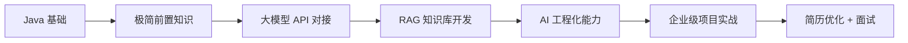
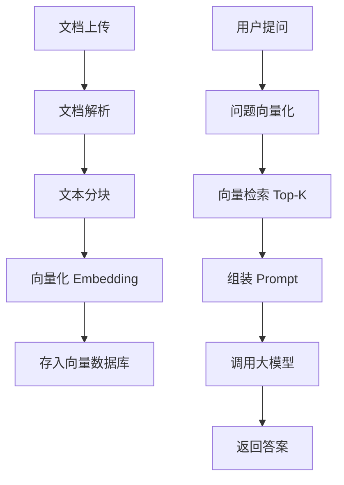

# Java + AI 应用落地工程师学习路线

## 📋 前言

作为一名 Java 工程师，如何在不转算法、不重学底层的前提下快速切入 AI 领域并拿到 offer？

**答案：做 Java+AI 应用落地工程师，主打工程化与业务价值。**

本文档记录我从传统 Java 开发转向 AI 应用开发的完整学习路径，包括技术选型、项目实战和面试准备。目标是成为**懂业务、懂框架、能落地的稀缺人才**。

### 核心定位

- ❌ 不做纯 Java CRUD 工程师
- ❌ 不做纯 AI 算法研究员
- ✅ **做 Java + AI 工程化落地专家**

### 学习路线图



---

## 🎯 一、三大方向选择（三选一）

### 1. 大模型应用开发 ⭐⭐⭐（首选）

**核心工作：**
- 用 Java 对接大模型 API（通义千问、文心一言、ChatGLM 等）
- 构建 RAG（检索增强生成）系统
- 实现智能问答、文档解析、知识库检索

**技术栈：**
- SpringBoot + LangChain4j
- 向量数据库（Milvus / Chroma / Pinecone）
- 大模型 API SDK

**优势：**
- 市场需求最大，岗位最多
- Java 工程化优势明显
- 容易出成果，适合写进简历

---

### 2. 现有业务 AI 改造 ⭐⭐

**核心工作：**
- 给现有 Java 系统增加 AI 能力
- 智能客服、风控审核、文档解析、日志智能分析
- 不换赛道，直接增值

**典型场景：**
- 电商系统：智能推荐、商品描述生成
- 金融系统：风险评估、合同审核
- OA 系统：智能审批、会议纪要生成

**优势：**
- 复用现有业务知识
- 降低转型风险
- 直接提升业务价值

---

### 3. 轻量级 AI 推理部署 ⭐

**核心工作：**
- 在 Java 应用中部署本地小模型
- 分词、文本分类、OCR 识别
- 优化业务场景，拔高技术壁垒

**技术栈：**
- DJL (Deep Java Library)
- ONNX Runtime
- Hugging Face Transformers (Java 绑定)

**优势：**
- 数据隐私性好（本地部署）
- 响应速度快
- 技术门槛较高，竞争少

---

### ❌ 不推荐方向

- 深度学习底层训练（需要大量数学基础）
- 纯算法岗（与 Java 割裂，性价比低）
- 只调 API 无工程化（缺乏竞争力）

---

## 📚 二、学习步骤（按顺序执行）

### 第一阶段：极简前置知识（3-5 天）

#### 1. Python 基础（可选，2-3 天）

**学习目标：** 能看懂 AI 示例代码即可，不深究底层

**核心内容：**
- 基础语法：变量、循环、函数
- 常用库调用：requests、json、os
- 阅读开源项目代码的能力

**资源推荐：**
- [Python 官方教程](https://docs.python.org/zh-cn/3/tutorial/)
- B站：廖雪峰 Python 教程

---

#### 2. AI 核心概念（1-2 天）

**必须理解的概念：**

| 概念 | 用途 | Java 工程师关注点 |
|------|------|------------------|
| 大模型 (LLM) | 自然语言处理核心 | API 调用方式、Token 计费、并发限制 |
| RAG | 检索增强生成 | 向量数据库集成、文档解析流程 |
| 向量数据库 | 存储语义向量 | Milvus/Chroma 的 Java SDK |
| Prompt | 提示词工程 | 如何设计高质量 Prompt |
| Embedding | 文本向量化 | 调用 embedding API 或本地模型 |

**学习建议：**
- 不用懂数学推导
- 理解每个概念的**应用场景**和**技术边界**
- 重点思考：**如何用 Java 实现这些功能**

---

### 第二阶段：核心技能突破（2-4 周）

#### 1. 大模型 API 对接（1 周）

**学习目标：** 用 SpringBoot 封装大模型 SDK，实现生产级调用

**核心功能：**
- ✅ 同步/异步调用
- ✅ 流式输出（SSE）
- ✅ 重试机制 + 熔断降级
- ✅ Token 计费统计
- ✅ 高并发场景优化

**技术要点：**
```java
// 示例：SpringBoot + WebClient 实现流式输出
@PostMapping("/chat/stream")
public Flux<String> chatStream(@RequestBody ChatRequest request) {
    return webClient.post()
        .uri(modelApiUrl)
        .bodyValue(request)
        .retrieve()
        .bodyToFlux(String.class);
}
```

**实践项目：**
- 搭建一个简单的聊天机器人后端
- 实现对话历史记录（Redis）
- 添加限流和监控（Sentinel + Prometheus）

---

#### 2. RAG 知识库开发 ⭐⭐⭐（重中之重，2-3 周）

**学习目标：** 独立完成企业级 RAG 系统，写入简历

**核心架构：**



**技术栈：**
- **文档解析：** Apache PDFBox、POI、Tika
- **文本分块：** LangChain4j DocumentSplitter
- **向量化：** 调用大模型 Embedding API 或本地模型
- **向量数据库：** Milvus（推荐）、Chroma、Pinecone
- **检索优化：** 关键词检索 + 向量检索混合

**核心功能清单：**
- ✅ 多格式文档上传（PDF/Word/TXT）
- ✅ 智能分块策略（按段落、按字数）
- ✅ 向量数据库 CRUD
- ✅ 相似度检索 + 重排序
- ✅ 权限控制（不同用户访问不同知识库）
- ✅ 引用来源标注（答案可追溯）

**实践项目：**
- **企业内部知识库问答系统**
  - 支持上传公司文档
  - 员工可以提问获取答案
  - 答案附带引用来源
  - 记录问答日志用于优化

---

#### 3. AI 工程化能力（1 周）

**这是 Java 工程师对比纯 AI 人的核心优势！**

**关键能力：**

| 能力 | 技术方案 | 业务价值 |
|------|---------|---------|
| 限流降级 | Sentinel、Resilience4j | 防止 API 超额调用 |
| 缓存优化 | Redis 缓存高频问答 | 降低成本，提升响应速度 |
| 监控告警 | Prometheus + Grafana | 实时监控 Token 消耗、响应时间 |
| 安全防护 | Prompt 注入检测、敏感词过滤 | 防止恶意攻击 |
| 日志追踪 | SkyWalking、ELK | 问题排查、效果优化 |
| 异步处理 | CompletableFuture、MQ | 提升吞吐量 |

**实践建议：**
- 在 RAG 项目中加入以上所有工程化能力
- 用数据说话：QPS 提升多少、成本降低多少

---

### 第三阶段：项目实战（1-2 个月）

#### 项目选题原则

✅ **优先选择 Java 主导的项目**
- 突出 Java 架构 + AI 落地
- 只调 API 无竞争力，解决业务问题才是核心

❌ **避免纯前端或纯算法项目**

---

#### 推荐项目清单

##### 项目 1：智能客服系统 ⭐⭐⭐

**业务场景：** 电商/教育/金融行业客服自动化

**技术亮点：**
- RAG + 多轮对话
- 意图识别（路由到不同知识库）
- 人工客服接管机制
- 对话质量评估

**简历描述示例：**
> 基于 SpringBoot + LangChain4j 开发智能客服系统，接入公司 5000+ 产品文档，客服响应时间从 30s 降至 3s，人工客服工作量减少 60%。

---

##### 项目 2：合同智能解析系统 ⭐⭐

**业务场景：** 法务/金融合同审核

**技术亮点：**
- PDF 文档结构化解析
- 关键信息抽取（金额、日期、条款）
- 风险条款自动标注
- 与现有 OA 系统集成

**技术栈：**
- Apache PDFBox + OCR（复杂表格）
- 大模型信息抽取（Prompt 工程）
- Elasticsearch 全文检索

---

##### 项目 3：业务风控系统 ⭐⭐

**业务场景：** 交易风控、内容审核

**技术亮点：**
- 实时文本分类（正常/违规）
- 异常行为检测
- 规则引擎 + AI 模型结合
- 高并发场景优化（万级 QPS）

**技术栈：**
- Kafka 实时数据流
- 本地小模型快速推理（DJL）
- Redis 实时特征计算

---

##### 项目 4：代码助手 ⭐

**业务场景：** 内部开发效率提升

**技术亮点：**
- 代码片段检索（RAG）
- 代码审查建议
- Bug 自动修复建议
- 与公司 GitLab 集成

---

## 🚀 三、竞争力提升关键

### 1. 定位清晰

**你的独特价值：**
- 懂 Java 工程化（高并发、微服务、分布式）
- 懂 AI 应用落地（RAG、向量数据库、Prompt 工程）
- 懂业务场景（能把 AI 技术转化为业务价值）

**市场定位：** Java+AI 全栈工程师（企业稀缺人才）

---

### 2. 简历聚焦

**✅ 应该突出的内容：**
- SpringBoot + LangChain4j 开发 RAG 系统
- 大模型接口高并发优化（具体数据）
- AI 改造提升业务指标（降本增效数据）
- 向量数据库选型和性能优化

**❌ 应该弱化的内容：**
- 传统 CRUD 项目（除非有亮点）
- 与 AI 无关的技能（JSP、Struts 等）
- 只调 API 无工程化的项目

**简历模板参考：**

```markdown
## 项目经历

### 企业智能客服系统（Java + AI）
**技术栈：** SpringBoot、LangChain4j、Milvus、Redis、Sentinel

**核心职责：**
- 设计并实现 RAG 架构，接入 5000+ 产品文档，问答准确率达 85%
- 优化大模型调用链路，通过缓存和异步处理，QPS 从 50 提升至 300
- 实现 Prompt 注入检测和敏感词过滤，保障系统安全
- 搭建 Prometheus + Grafana 监控体系，实时追踪 Token 消耗

**业务价值：**
- 客服响应时间从 30s 降至 3s
- 人工客服工作量减少 60%，年节省人力成本 200 万
```

---

### 3. 面试准备

**必考知识点：**

#### RAG 相关
- RAG 的核心流程是什么？
- 如何优化向量检索的准确率？
- 文本分块的策略有哪些？如何选择？
- 如何处理长文档（超过模型上下文限制）？

#### 向量数据库
- Milvus vs Chroma vs Pinecone 的选型依据？
- 向量索引的原理（HNSW、IVF）？
- 如何优化向量检索性能？

#### AI 工程化
- 如何防止 Prompt 注入攻击？
- 如何优化大模型调用的响应时间？
- 如何实现流式输出（SSE）？
- 如何监控和治理 Token 消耗？

#### 业务场景设计
- 如果让你设计一个智能客服系统，你会怎么做？
- 如何评估 RAG 系统的效果？
- 如何处理用户反馈的错误答案？

**面试技巧：**
- 用 Java 视角解答 AI 问题（体现差异化优势）
- 强调工程化思维（稳定性、性能、可维护性）
- 用数据说话（QPS、响应时间、成本节约）

---

## ⚠️ 四、避坑指南

### 常见误区

❌ **误区 1：花大量时间学高数推导**
- ✅ 正确做法：理解概念用途即可，重点在工程实现

❌ **误区 2：放弃 Java 转 Python 做算法**
- ✅ 正确做法：守住 Java 基本盘，叠加 AI 能力

❌ **误区 3：只调 API，无工程化**
- ✅ 正确做法：加入限流、缓存、监控、安全防护

❌ **误区 4：追求完美再开始**
- ✅ 正确做法：先跑通 Demo，再迭代优化

---

## 📅 五、3 个月行动计划

### 第 1 个月：跑通大模型调用 Demo

**目标：** 完成第一个可运行的 AI 应用

**具体任务：**
- Week 1：学习 Python 基础和 AI 核心概念
- Week 2：注册大模型账号（通义千问/文心一言），调用 API
- Week 3：用 SpringBoot 封装 API，实现聊天机器人
- Week 4：加入基础工程化（日志、异常处理、限流）

**产出：**
- GitHub 仓库：简单的聊天机器人后端
- 博客文章：《Java 调用大模型 API 入门》

---

### 第 2 个月：完成 RAG 项目（可上线/可演示）

**目标：** 打造一个企业级 RAG 系统

**具体任务：**
- Week 5：学习向量数据库（Milvus），完成安装和基础操作
- Week 6：实现文档解析和向量化流程
- Week 7：实现向量检索和大模型问答
- Week 8：加入工程化能力（缓存、监控、安全防护）

**产出：**
- GitHub 仓库：完整的 RAG 知识库系统
- 在线 Demo（可选，部署到云服务器）
- 博客文章：《SpringBoot + LangChain4j 打造企业级 RAG 系统》

---

### 第 3 个月：项目优化 + 简历精修 + 投递面试

**目标：** 拿到 Java+AI 方向的 offer

**具体任务：**
- Week 9：项目性能优化（响应时间、并发能力）
- Week 10：补充业务场景（权限控制、多租户、审计日志）
- Week 11：简历精修 + LeetCode 刷题（保持手感）
- Week 12：投递简历 + 模拟面试

**产出：**
- 精修后的简历（突出 Java+AI 能力）
- 面试题库整理（RAG、向量数据库、工程化）
- 至少 3 个面试机会

---

## 💡 六、学习资源推荐

### 官方文档
- [LangChain4j 官方文档](https://docs.langchain4j.dev/)
- [Milvus 向量数据库文档](https://milvus.io/docs)
- [通义千问 API 文档](https://help.aliyun.com/zh/dashscope/)

### 视频教程
- B站：搜索 "LangChain4j 教程"
- Coursera：吴恩达《AI For Everyone》（了解 AI 全景）

### 开源项目参考
- [langchain4j-examples](https://github.com/langchain4j/langchain4j-examples)
- [spring-ai-alibaba](https://github.com/alibaba/spring-ai-alibaba)

### 社区
- GitHub：关注 langchain4j、spring-ai 项目
- 知乎：关注 "大模型应用开发" 话题
- 掘金：搜索 "Java + AI" 相关文章

---

## 🎯 总结

**一句话总结：**
> 守住 Java 基本盘，叠加 RAG / 向量库 / 大模型调用的工程化能力，用业务落地项目拿 offer。

**核心竞争力公式：**
```
Java 工程化能力 + AI 应用开发经验 + 业务场景理解 = 稀缺人才
```

**行动建议：**
1. 今天就开始，不要等"准备好"
2. 先跑通 Demo，建立信心
3. 边学边写博客，沉淀知识
4. 项目完成后立即投简历，在面试中学习

---

*最后更新: 2026-05-14*

*本文档将持续更新，记录我的 Java+AI 转型之路。*
