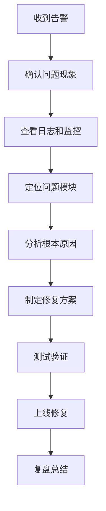

# AI 辅助测试与问题排查实战：从单元测试到线上故障定位

> **写在前面：** 测试和问题排查是后端开发的两大痛点。传统方式编写测试用例耗时费力，线上问题排查依赖经验且效率低下。借助 AI，我们可以快速生成高质量单元测试、自动化接口测试、智能分析日志和异常堆栈。本文详细记录如何使用 AI 提升测试覆盖率、加速问题定位，让开发效率提升 5-10 倍！

---

## 📋 目录

- [一、AI 辅助测试的价值](#一ai-辅助测试的价值)
- [二、单元测试自动生成](#二单元测试自动生成)
- [三、接口测试自动化](#三接口测试自动化)
- [四、Mock 数据生成](#四mock-数据生成)
- [五、性能测试脚本生成](#五性能测试脚本生成)
- [六、日志智能分析](#六日志智能分析)
- [七、异常堆栈解读](#七异常堆栈解读)
- [八、线上问题排查流程](#八线上问题排查流程)
- [九、AI 辅助调试技巧](#九ai-辅助调试技巧)
- [十、最佳实践总结](#十最佳实践总结)

---

## 一、AI 辅助测试的价值

### 1.1 传统测试 vs AI 辅助测试对比

| 维度 | 传统方式 | AI 辅助 | 效率提升 |
|------|---------|---------|---------|
| **单元测试编写** | 30 分钟/类 | 5 分钟/类 | **6 倍** |
| **测试覆盖率** | 60-70% | 85-95% | **+25%** |
| **接口测试脚本** | 20 分钟/接口 | 3 分钟/接口 | **7 倍** |
| **Bug 定位时间** | 2-4 小时 | 30-60 分钟 | **4 倍** |
| **日志分析** | 手动筛选 | 自动提取关键信息 | **10 倍** |

---

### 1.2 适用场景

**✅ 适合 AI 辅助的场景：**

1. **重复性测试代码生成**
   - CRUD 方法的单元测试
   - 参数校验测试
   - 边界条件测试

2. **测试数据构造**
   - Mock 对象生成
   - 测试数据集生成
   - 边界值生成

3. **日志分析**
   - 错误日志分类
   - 异常模式识别
   - 根因分析

4. **问题排查**
   - 异常堆栈解读
   - 性能瓶颈定位
   - 配置问题诊断

**❌ 不适合完全依赖 AI 的场景：**

1. 复杂业务逻辑验证
2. 安全性测试
3. 用户体验测试
4. 架构设计评审

---

## 二、单元测试自动生成

### 2.1 JUnit 5 + Mockito 测试生成

**被测代码：**

```java
package com.example.service;

import com.example.entity.User;
import com.example.mapper.UserMapper;
import lombok.RequiredArgsConstructor;
import org.springframework.stereotype.Service;

@Service
@RequiredArgsConstructor
public class UserService {

    private final UserMapper userMapper;

    public User getUserById(Long id) {
        if (id == null || id <= 0) {
            throw new IllegalArgumentException("用户ID无效");
        }
        
        User user = userMapper.selectById(id);
        if (user == null) {
            throw new BusinessException("用户不存在");
        }
        
        return user;
    }

    public Long createUser(User user) {
        // 参数校验
        if (user == null) {
            throw new IllegalArgumentException("用户信息不能为空");
        }
        if (user.getUsername() == null || user.getUsername().isEmpty()) {
            throw new IllegalArgumentException("用户名不能为空");
        }
        
        // 检查用户名是否已存在
        User existing = userMapper.selectByUsername(user.getUsername());
        if (existing != null) {
            throw new BusinessException("用户名已存在");
        }
        
        // 保存用户
        userMapper.insert(user);
        return user.getId();
    }
}
```

---

**AI 生成测试用例提示词：**

```markdown
你是一位测试专家，精通 JUnit 5 和 Mockito

请为以下 UserService 生成完整的单元测试，要求如下：

【被测类】
[粘贴上面的代码]

【测试要求】
1. 覆盖率不低于 90%
2. 覆盖正常场景、边界场景、异常场景
3. 使用 Mockito Mock UserMapper
4. 使用 @ParameterizedTest 测试多种输入
5. 断言使用 AssertJ（更语义化）
6. 测试方法命名规范：should_预期结果_when_输入条件
7. 每个测试方法添加注释说明测试意图

【输出格式】
完整的测试类代码，包含：
1. 测试类结构
2. Mock 配置
3. 所有测试方法
4. 辅助方法
```

---

**AI 生成的测试代码：**

```java
package com.example.service;

import com.example.entity.User;
import com.example.exception.BusinessException;
import com.example.mapper.UserMapper;
import org.assertj.core.api.Assertions;
import org.junit.jupiter.api.BeforeEach;
import org.junit.jupiter.api.DisplayName;
import org.junit.jupiter.api.Nested;
import org.junit.jupiter.api.Test;
import org.junit.jupiter.params.ParameterizedTest;
import org.junit.jupiter.params.provider.ValueSource;
import org.mockito.InjectMocks;
import org.mockito.Mock;
import org.mockito.MockitoAnnotations;

import static org.mockito.ArgumentMatchers.any;
import static org.mockito.ArgumentMatchers.eq;
import static org.mockito.Mockito.*;

/**
 * UserService 单元测试
 */
@DisplayName("UserService 测试")
class UserServiceTest {

    @Mock
    private UserMapper userMapper;

    @InjectMocks
    private UserService userService;

    @BeforeEach
    void setUp() {
        MockitoAnnotations.openMocks(this);
    }

    @Nested
    @DisplayName("getUserById 方法测试")
    class GetUserByIdTests {

        @Test
        @DisplayName("应该成功返回用户_when_提供有效ID")
        void shouldReturnUser_whenValidIdProvided() {
            // Given
            Long userId = 1L;
            User mockUser = new User();
            mockUser.setId(userId);
            mockUser.setUsername("testuser");
            
            when(userMapper.selectById(userId)).thenReturn(mockUser);

            // When
            User result = userService.getUserById(userId);

            // Then
            Assertions.assertThat(result).isNotNull();
            Assertions.assertThat(result.getId()).isEqualTo(userId);
            Assertions.assertThat(result.getUsername()).isEqualTo("testuser");
            
            verify(userMapper, times(1)).selectById(userId);
        }

        @ParameterizedTest
        @ValueSource(longs = {0, -1, -100})
        @DisplayName("应该抛出异常_when_ID无效")
        void shouldThrowException_whenInvalidId(Long invalidId) {
            Assertions.assertThatThrownBy(() -> userService.getUserById(invalidId))
                .isInstanceOf(IllegalArgumentException.class)
                .hasMessageContaining("用户ID无效");
            
            verify(userMapper, never()).selectById(any());
        }

        @Test
        @DisplayName("应该抛出异常_when_用户不存在")
        void shouldThrowException_whenUserNotFound() {
            // Given
            Long userId = 999L;
            when(userMapper.selectById(userId)).thenReturn(null);

            // When & Then
            Assertions.assertThatThrownBy(() -> userService.getUserById(userId))
                .isInstanceOf(BusinessException.class)
                .hasMessageContaining("用户不存在");
        }
    }

    @Nested
    @DisplayName("createUser 方法测试")
    class CreateUserTests {

        @Test
        @DisplayName("应该成功创建用户_when_提供有效信息")
        void shouldCreateUser_whenValidUserInfoProvided() {
            // Given
            User newUser = new User();
            newUser.setUsername("newuser");
            newUser.setEmail("newuser@example.com");
            
            when(userMapper.selectByUsername("newuser")).thenReturn(null);
            when(userMapper.insert(any(User.class))).thenAnswer(invocation -> {
                User user = invocation.getArgument(0);
                user.setId(1L);
                return 1;
            });

            // When
            Long userId = userService.createUser(newUser);

            // Then
            Assertions.assertThat(userId).isEqualTo(1L);
            verify(userMapper, times(1)).selectByUsername("newuser");
            verify(userMapper, times(1)).insert(newUser);
        }

        @Test
        @DisplayName("应该抛出异常_when_用户信息为空")
        void shouldThrowException_whenUserIsNull() {
            Assertions.assertThatThrownBy(() -> userService.createUser(null))
                .isInstanceOf(IllegalArgumentException.class)
                .hasMessageContaining("用户信息不能为空");
        }

        @Test
        @DisplayName("应该抛出异常_when_用户名为空")
        void shouldThrowException_whenUsernameIsEmpty() {
            User user = new User();
            user.setUsername("");
            
            Assertions.assertThatThrownBy(() -> userService.createUser(user))
                .isInstanceOf(IllegalArgumentException.class)
                .hasMessageContaining("用户名不能为空");
        }

        @Test
        @DisplayName("应该抛出异常_when_用户名已存在")
        void shouldThrowException_whenUsernameExists() {
            // Given
            User user = new User();
            user.setUsername("existinguser");
            
            User existingUser = new User();
            existingUser.setId(1L);
            existingUser.setUsername("existinguser");
            
            when(userMapper.selectByUsername("existinguser")).thenReturn(existingUser);

            // When & Then
            Assertions.assertThatThrownBy(() -> userService.createUser(user))
                .isInstanceOf(BusinessException.class)
                .hasMessageContaining("用户名已存在");
            
            verify(userMapper, never()).insert(any());
        }
    }
}
```

---

### 2.2 测试覆盖率分析

**运行测试并生成报告：**

```bash
# Maven 命令
mvn test jacoco:report

# 查看报告
open target/site/jacoco/index.html
```

**覆盖率目标：**
- 行覆盖率：≥ 85%
- 分支覆盖率：≥ 80%
- 方法覆盖率：≥ 90%

---

## 三、接口测试自动化

### 3.1 Postman 脚本生成

**需求：** 为用户管理接口生成测试脚本

**AI 生成提示词：**

```markdown
你是一位 API 测试专家

请为以下用户管理接口生成 Postman 测试脚本：

【接口列表】
1. POST /api/users/register - 用户注册
2. POST /api/users/login - 用户登录
3. GET /api/users/{id} - 查询用户
4. PUT /api/users/{id} - 更新用户
5. DELETE /api/users/{id} - 删除用户

【要求】
1. 使用 Postman Tests 脚本
2. 包含状态码验证
3. 包含响应体字段验证
4. 包含性能验证（响应时间 < 500ms）
5. 设置环境变量（token、userId）
6. 添加测试说明注释

【输出格式】
每个接口的 Tests 脚本代码
```

---

**AI 生成的 Postman Tests 脚本：**

```javascript
// POST /api/users/register - 用户注册

// 1. 状态码验证
pm.test("状态码应该是 200", function () {
    pm.response.to.have.status(200);
});

// 2. 响应时间验证
pm.test("响应时间应该小于 500ms", function () {
    pm.expect(pm.response.responseTime).to.be.below(500);
});

// 3. 响应体格式验证
pm.test("响应体应该包含 success 和 data 字段", function () {
    const response = pm.response.json();
    pm.expect(response).to.have.property('success');
    pm.expect(response).to.have.property('data');
    pm.expect(response.success).to.be.true;
});

// 4. 业务逻辑验证
pm.test("应该返回用户ID", function () {
    const response = pm.response.json();
    pm.expect(response.data).to.be.a('number');
    pm.expect(response.data).to.be.above(0);
    
    // 保存 userId 到环境变量
    pm.environment.set("userId", response.data);
});

// 5. 响应头验证
pm.test("Content-Type 应该是 application/json", function () {
    pm.response.to.have.header("Content-Type");
    pm.expect(pm.response.headers.get("Content-Type")).to.include("application/json");
});
```

---

### 3.2 Apifox 自动化测试

**生成 YAML 测试文件：**

```yaml
tests:
  - name: 用户注册测试
    request:
      method: POST
      url: {{base_url}}/api/users/register
      headers:
        Content-Type: application/json
      body:
        phone: "13800138000"
        password: "Abc12345"
        verifyCode: "123456"
    
    validations:
      - type: statusCode
        expected: 200
      
      - type: jsonPath
        path: $.success
        expected: true
      
      - type: jsonPath
        path: $.data
        expectedType: number
      
      - type: responseTime
        expected: < 500
    
    extract:
      - name: userId
        path: $.data
```

---

## 四、Mock 数据生成

### 4.1 测试数据批量生成

**需求：** 生成 1000 条用户测试数据

**AI 生成提示词：**

```markdown
你是一位测试数据生成专家

请帮我生成 1000 条用户测试数据，要求如下：

【字段要求】
1. username：唯一，格式 user_0001 ~ user_1000
2. phone：中国大陆手机号，11 位数字
3. email：格式 username@example.com
4. age：18-65 岁随机
5. gender：0/1/2 随机分布
6. create_time：最近 1 年内的随机时间

【输出格式】
INSERT INTO users (username, phone, email, age, gender, create_time) VALUES
(...),
(...),
...;

【额外要求】
1. 数据要真实合理
2. 避免明显规律
3. 每 100 条换行
```

---

**AI 生成的 SQL（部分）：**

```sql
INSERT INTO users (username, phone, email, age, gender, create_time) VALUES
('user_0001', '13812345678', 'user_0001@example.com', 25, 1, '2025-03-15 10:23:45'),
('user_0002', '13923456789', 'user_0002@example.com', 32, 2, '2025-04-20 14:56:12'),
('user_0003', '13734567890', 'user_0003@example.com', 28, 1, '2025-02-10 09:15:30'),
...
('user_1000', '13698765432', 'user_1000@example.com', 45, 0, '2025-05-01 16:42:18');
```

---

### 4.2 JSON Mock 数据生成

**需求：** 生成订单列表的 Mock 数据

```json
{
  "code": 200,
  "message": "success",
  "data": {
    "total": 100,
    "pageNum": 1,
    "pageSize": 10,
    "items": [
      {
        "orderId": "ORD20260517001",
        "userId": 1001,
        "amount": 299.00,
        "status": 2,
        "createTime": "2026-05-17T10:30:00",
        "items": [
          {
            "productId": 101,
            "productName": "iPhone 15",
            "quantity": 1,
            "price": 299.00
          }
        ]
      }
      // ... 更多订单项
    ]
  }
}
```

---

## 五、性能测试脚本生成

### 5.1 JMeter 测试计划生成

**需求：** 为用户登录接口生成压力测试脚本

**AI 生成提示词：**

```markdown
你是一位性能测试专家

请为我生成 JMeter 压力测试方案，测试用户登录接口：

【接口信息】
- URL: POST /api/users/login
- 请求体：{"phone": "13800138000", "password": "Abc12345"}
- 预期响应时间：< 200ms

【测试场景】
1. 基准测试：10 并发，持续 1 分钟
2. 负载测试：50 并发，持续 5 分钟
3. 压力测试：100 并发，持续 10 分钟
4. 稳定性测试：20 并发，持续 1 小时

【要求】
1. 提供 JMeter 配置步骤
2. 提供命令行执行脚本
3. 提供监控指标
4. 提供结果分析方法

【输出格式】
详细的测试方案和脚本
```

---

**AI 生成的 JMeter 配置：**

```xml
<!-- JMeter 测试计划（简化版） -->
<jmeterTestPlan version="1.2">
  <hashTree>
    <ThreadGroup>
      <stringProp name="ThreadGroup.num_threads">50</stringProp>
      <stringProp name="ThreadGroup.ramp_time">10</stringProp>
      <stringProp name="ThreadGroup.duration">300</stringProp>
    </ThreadGroup>
    
    <HTTPSamplerProxy>
      <stringProp name="HTTPSampler.domain">localhost</stringProp>
      <stringProp name="HTTPSampler.port">8080</stringProp>
      <stringProp name="HTTPSampler.path">/api/users/login</stringProp>
      <stringProp name="HTTPSampler.method">POST</stringProp>
      <elementProp name="HTTPsampler.Arguments">
        <collectionProp>
          <elementProp>
            <stringProp name="Argument.name">phone</stringProp>
            <stringProp name="Argument.value">13800138000</stringProp>
          </elementProp>
          <elementProp>
            <stringProp name="Argument.name">password</stringProp>
            <stringProp name="Argument.value">Abc12345</stringProp>
          </elementProp>
        </collectionProp>
      </elementProp>
    </HTTPSamplerProxy>
    
    <ResultCollector>
      <stringProp name="filename">results.jtl</stringProp>
    </ResultCollector>
  </hashTree>
</jmeterTestPlan>
```

---

### 5.2 压测执行与分析

**命令行执行：**

```bash
# 执行测试
jmeter -n -t login-test.jmx -l results.jtl

# 生成 HTML 报告
jmeter -g results.jtl -o report/
```

**关键指标：**

| 指标 | 合格标准 | 优秀标准 |
|------|---------|---------|
| 平均响应时间 | < 500ms | < 200ms |
| P95 响应时间 | < 1s | < 500ms |
| P99 响应时间 | < 2s | < 1s |
| 错误率 | < 1% | < 0.1% |
| TPS | > 100 | > 500 |

---

## 六、日志智能分析

### 6.1 错误日志分类

**原始日志：**

```
2026-05-17 10:30:15.123 ERROR [http-nio-8080-exec-1] c.e.s.UserService - 用户查询失败
java.lang.NullPointerException: Cannot invoke method on null object
    at com.example.service.UserService.getUserById(UserService.java:25)
    at com.example.controller.UserController.getUser(UserController.java:40)
    ...

2026-05-17 10:30:16.456 ERROR [http-nio-8080-exec-2] c.e.s.OrderService - 订单创建失败
org.springframework.dao.DuplicateKeyException: Duplicate entry 'ORD20260517001' for key 'uk_order_no'
    at com.example.service.OrderService.createOrder(OrderService.java:50)
    ...

2026-05-17 10:30:17.789 WARN  [http-nio-8080-exec-3] c.e.c.RateLimiter - 触发限流
ip=192.168.1.100, qps=15, limit=10
```

---

**AI 辅助分析提示词：**

```markdown
你是一位日志分析专家

请分析以下应用日志，完成以下任务：

【日志内容】
[粘贴上面的日志]

【分析要求】
1. 按错误类型分类（NullPointerException、DuplicateKeyException 等）
2. 提取关键信息（类名、方法名、行号）
3. 判断严重程度（Critical/Warning/Info）
4. 给出可能的原因
5. 提供解决方案建议

【输出格式】
## 错误统计
| 错误类型 | 次数 | 严重程度 |
|----------|------|---------|

## 详细分析
### 1. NullPointerException
- 位置：UserService.getUserById:25
- 原因：...
- 解决方案：...

### 2. DuplicateKeyException
...
```

---

**AI 输出的分析结果：**

```markdown
## 错误统计
| 错误类型 | 次数 | 严重程度 |
|----------|------|---------|
| NullPointerException | 1 | Critical |
| DuplicateKeyException | 1 | Warning |
| RateLimitExceeded | 1 | Info |

## 详细分析

### 1. NullPointerException
- **位置：** UserService.getUserById(UserService.java:25)
- **调用链：** UserController.getUser → UserService.getUserById
- **原因：** userMapper.selectById() 返回 null，后续代码未做空指针检查
- **解决方案：** 
  ```java
  User user = userMapper.selectById(id);
  if (user == null) {
      throw new BusinessException("用户不存在");
  }
  ```

### 2. DuplicateKeyException
- **位置：** OrderService.createOrder(OrderService.java:50)
- **原因：** 订单号重复，可能是并发创建或重试机制导致
- **解决方案：**
  1. 添加分布式锁防止并发创建
  2. 使用数据库唯一约束捕获异常
  3. 实现幂等性控制

### 3. RateLimitExceeded
- **位置：** RateLimiter
- **原因：** IP 192.168.1.100 QPS 超过限制（15 > 10）
- **解决方案：** 这是正常的限流行为，无需处理
```

---

### 6.2 ELK 日志查询优化

**常用查询语句：**

```kibana
# 1. 查询最近 1 小时的 ERROR 日志
level: ERROR AND @timestamp: [now-1h TO now]

# 2. 查询特定类的异常
logger: "com.example.service.UserService" AND level: ERROR

# 3. 统计错误类型分布
level: ERROR | stats count() by exception_type

# 4. 查找慢查询日志
message: "*slow query*" AND duration_ms > 1000

# 5. 关联追踪 ID
trace_id: "abc123"
```

---

## 七、异常堆栈解读

### 7.1 常见异常类型

#### 1. NullPointerException

**堆栈示例：**

```
java.lang.NullPointerException: Cannot invoke "String.length()" because "str" is null
    at com.example.util.StringHelper.reverse(StringHelper.java:15)
    at com.example.service.UserService.formatUsername(UserService.java:30)
    at com.example.controller.UserController.register(UserController.java:25)
```

**AI 解读：**

```markdown
**问题分析：**
1. 根本原因：str 变量为 null
2. 出错位置：StringHelper.reverse 方法第 15 行
3. 调用链：UserController.register → UserService.formatUsername → StringHelper.reverse

**解决方案：**
1. 在 StringHelper.reverse 方法开头添加空指针检查
2. 或在调用方确保传入非 null 值
3. 使用 Optional 包装可能为 null 的值

**修复代码：**
```java
public String reverse(String str) {
    if (str == null) {
        return null;  // 或抛出明确异常
    }
    return new StringBuilder(str).reverse().toString();
}
```
```

---

#### 2. ConcurrentModificationException

**堆栈示例：**

```
java.util.ConcurrentModificationException
    at java.util.ArrayList$Itr.checkForComodification(ArrayList.java:901)
    at com.example.service.OrderService.batchUpdate(OrderService.java:45)
```

**AI 解读：**

```markdown
**问题分析：**
在遍历 ArrayList 的同时修改了列表结构

**常见场景：**
```java
for (Order order : orders) {
    if (order.getStatus() == 0) {
        orders.remove(order);  // ❌ 并发修改
    }
}
```

**解决方案：**
1. 使用 Iterator 移除
2. 使用 removeIf
3. 收集后统一移除

**修复代码：**
```java
orders.removeIf(order -> order.getStatus() == 0);  // ✅ 安全
```
```

---

#### 3. DeadlockDetectedException

**堆栈示例：**

```
com.mysql.jdbc.exceptions.jdbc4.MySQLTransactionRollbackException: Deadlock found
    at com.example.service.TransferService.transfer(TransferService.java:30)
```

**AI 解读：**

```markdown
**问题分析：**
两个事务互相等待对方释放锁，形成死锁

**典型场景：**
```
事务 A：UPDATE accounts SET balance=balance-100 WHERE id=1;
         UPDATE accounts SET balance=balance+100 WHERE id=2;

事务 B：UPDATE accounts SET balance=balance-50 WHERE id=2;
         UPDATE accounts SET balance=balance+50 WHERE id=1;
```

**解决方案：**
1. 固定加锁顺序（始终先锁 id=1，再锁 id=2）
2. 降低隔离级别
3. 设置超时时间

**修复代码：**
```java
@Transactional
public void transfer(Long fromId, Long toId, BigDecimal amount) {
    // 始终按 ID 升序加锁
    if (fromId > toId) {
        swap(fromId, toId);
    }
    
    accountMapper.updateBalance(fromId, amount.negate());
    accountMapper.updateBalance(toId, amount);
}
```
```

---

## 八、线上问题排查流程

### 8.1 标准化排查流程



---

### 8.2 AI 辅助排查案例

**场景：** 线上接口响应突然变慢

**步骤 1：收集信息**

```bash
# 1. 查看慢查询日志
tail -f /var/log/mysql/slow.log

# 2. 查看应用日志
grep "ERROR" /var/log/app/application.log | tail -100

# 3. 查看系统资源
top -p $(pgrep java)
vmstat 1 10

# 4. 查看 JVM 信息
jstat -gc $(pgrep java) 1000 10
```

---

**步骤 2：AI 辅助分析**

**提示词：**

```markdown
你是一位资深运维工程师

我的线上接口响应突然变慢，请帮我分析可能的原因：

【现象】
- 接口：GET /api/orders
- 正常响应时间：50ms
- 当前响应时间：3-5 秒
- 发生时间：今天下午 2 点开始
- 影响范围：所有用户

【监控数据】
- CPU 使用率：85%（正常 30%）
- 内存使用率：92%（正常 60%）
- 数据库连接数：95/100（接近上限）
- GC 频率：每分钟 10 次 Full GC（正常 0 次）

【日志信息】
- 大量 "Connection pool exhausted" 错误
- 慢查询日志显示某 SQL 执行时间从 10ms 变成 2 秒

【可能原因分析】
请列出最可能的 5 个原因，按概率排序，并提供验证方法和解决方案
```

---

**AI 输出的分析结果：**

```markdown
## 可能原因分析（按概率排序）

### 1. 数据库慢查询导致连接池耗尽（概率 80%）
**证据：**
- 慢查询日志显示某 SQL 变慢
- 数据库连接数接近上限
- Connection pool exhausted 错误

**验证方法：**
```sql
-- 查看当前正在执行的慢查询
SHOW FULL PROCESSLIST;

-- 分析慢查询
EXPLAIN [慢查询 SQL];
```

**解决方案：**
1. 立即杀掉慢查询：`KILL [process_id];`
2. 添加缺失索引
3. 优化 SQL 语句

---

### 2. 内存泄漏导致频繁 Full GC（概率 60%）
**证据：**
- 内存使用率 92%
- 每分钟 10 次 Full GC
- CPU 使用率高（GC 占用）

**验证方法：**
```bash
# dump 堆内存
jmap -dump:format=b,file=heap.hprof [pid]

# 分析堆内存
jhat heap.hprof
```

**解决方案：**
1. 重启服务临时恢复
2. 分析 heap dump 找到泄漏点
3. 修复代码并重新部署

---

### 3. 突发流量导致过载（概率 40%）
**证据：**
- CPU 使用率高
- 所有用户受影响

**验证方法：**
```bash
# 查看 QPS
grep "/api/orders" access.log | wc -l

# 查看并发连接数
netstat -an | grep ESTABLISHED | wc -l
```

**解决方案：**
1. 启用限流保护
2. 扩容服务器
3. 启用缓存

---

（后续原因略）

## 推荐处理顺序

1. **立即执行：** 杀掉慢查询，恢复服务
2. **短期优化：** 添加索引，优化 SQL
3. **中期改进：** 修复内存泄漏，优化 GC
4. **长期规划：** 建立完善的监控告警体系
```

---

## 九、AI 辅助调试技巧

### 9.1 断点调试辅助

**场景：** 代码逻辑复杂，难以理解执行流程

**AI 辅助：**

```markdown
你是一位 Java 调试专家

请帮我分析以下代码的执行流程，指出可能的 bug：

【代码】
[粘贴代码]

【要求】
1. 画出执行流程图
2. 标注关键变量的变化
3. 指出潜在的逻辑错误
4. 建议添加断点的位置
5. 提供调试技巧
```

---

### 9.2 远程调试配置

**IDEA 远程调试配置：**

```bash
# JVM 启动参数
-javaagent:/path/to/agent.jar
-Xdebug
-Xrunjdwp:transport=dt_socket,server=y,suspend=n,address=5005
```

**IDEA 配置：**
1. Run → Edit Configurations
2. Add New Configuration → Remote JVM Debug
3. Host: 服务器 IP
4. Port: 5005

---

## 十、最佳实践总结

### 10.1 测试规范

✅ **应该做的：**

1. 每个公共方法都有单元测试
2. 测试覆盖率 ≥ 85%
3. 使用有意义的测试方法名
4. 遵循 AAA 模式（Arrange-Act-Assert）
5. 测试独立，不依赖执行顺序
6. Mock 外部依赖
7. 定期运行测试

❌ **不应该做的：**

1. ❌ 测试中包含业务逻辑
2. ❌ 测试之间相互依赖
3. ❌ 忽略失败的测试
4. ❌ 测试硬编码数据
5. ❌ 测试生产环境

---

### 10.2 问题排查规范

✅ **应该做的：**

1. 保留完整的日志和监控数据
2. 使用统一的日志格式
3. 添加必要的追踪 ID
4. 建立标准化的排查流程
5. 记录问题和解决方案（知识库）
6. 定期复盘，持续改进

❌ **不应该做的：**

1. ❌ 直接重启服务而不分析原因
2. ❌ 在生产环境随意修改配置
3. ❌ 忽略警告日志
4. ❌ 不记录排查过程
5. ❌ 同样的问题反复出现

---

## 💡 总结

### 核心要点回顾

1. **AI 辅助测试提效显著**：单元测试、接口测试、性能测试
2. **日志分析智能化**：自动分类、根因分析
3. **异常堆栈快速解读**：定位问题、给出方案
4. **标准化排查流程**：提高效率、减少遗漏
5. **持续改进**：建立知识库、定期复盘

### 下一步行动

1. 为核心业务代码补充单元测试
2. 建立自动化测试流水线
3. 完善日志和监控体系
4. 建立问题排查知识库
5. 定期组织技术分享

---

*最后更新: 2026-05-17*

*作者：洛苡苑香 | Java 工程师转型 AI 应用开发中*
